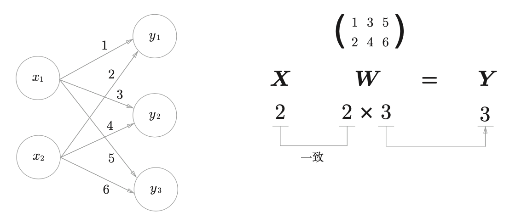

# 深度学习入门: 基于Python的理论与实现

## Python Crash Course

- NumPy
- Matplotlib

## 感知机 Perceptron

- 单层感知机可以实现与门、与非门、或门，局限在于无法实现异或门，因为其线性性
- 多层感知机具有非线性，可以解决异或门的问题
- 使用了非线性的sigmoid函数的2层感知机可以表示任何函数
- 感知机的权重和偏置是人工设定的，所以会引出神经网络，自动从训练数据学习到合适的权重参数
- 感知机使用跃迁函数，神经网络使用激活函数

## 神经网络

### 激活函数

Sigmoid Activation Function:

$$
h(x) = \frac{1}{1+exp(-x)}
$$

Sigmoid函数和跃迁函数的比较:  
- Sigmoid函数更平滑
- 两者都是非线性函数，神经网络必须使用非线性函数

### 网络传递=矩阵运算

### 输出层的设计

- 神经网络目标解决的问题：回归问题、分类问题
- 输出层: 回归问题使用恒等函数，分类问题使用 softmax 函数

Softmax Function:

$$
y_k = \frac{exp(a_k)}{\sum_{i=1}^n exp(a_i)}
$$

Softmax 函数的缺陷:  
- 因为有指数运算，所以可能存在溢出问题（inf）
- 在进行 softmax 的指数函数的运算时，加上(或者减去) 某个常数并不会改变运算的结果
- 为了防止溢出，一般会使用输入信号中的最大值

$$
y_k = \frac{\exp(a_k)}{\sum_{i=1}^n \exp(a_i)} = \frac{C \exp(a_k)}{C \sum_{i=1}^n \exp(a_i)}
$$

$$
= \frac{\exp(a_k + \log C)}{\sum_{i=1}^n \exp(a_i + \log C)}
= \frac{\exp(a_k + C')}{\sum_{i=1}^n \exp(a_i + C')}
$$

解决机器学习问题可以被划分为 学习 和 推理 两个阶段:  
- 学习和反向传播有关，推理只和前向传播有关
- 推理阶段一般不使用 softmax
- 因为 softmax 是和神经网络的学习有关

