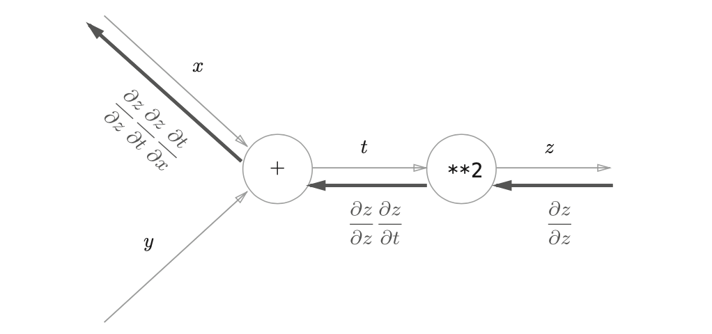
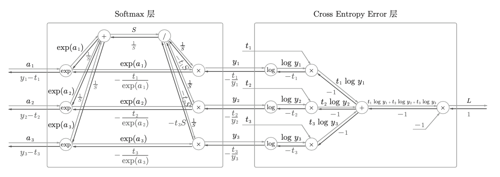

# 深度学习入门: 基于Python的理论与实现

## Python Crash Course

- NumPy
- Matplotlib

## 感知机 Perceptron

- 单层感知机可以实现与门、与非门、或门，局限在于无法实现异或门，因为其线性性
- 多层感知机具有非线性，可以解决异或门的问题
- 使用了非线性的sigmoid函数的2层感知机可以表示任何函数
- 感知机的权重和偏置是人工设定的，所以会引出神经网络，自动从训练数据学习到合适的权重参数
- 感知机使用跃迁函数，神经网络使用激活函数

## 神经网络

### 激活函数

Sigmoid Activation Function:

$$
h(x) = \frac{1}{1+exp(-x)}
$$

Sigmoid函数和跃迁函数的比较:  
- Sigmoid函数更平滑
- 两者都是非线性函数，神经网络必须使用非线性函数

### 网络传递=矩阵运算


### 输出层的设计

- 神经网络目标解决的问题：回归问题、分类问题
- 输出层: 回归问题使用恒等函数，分类问题使用 softmax 函数
- 分类问题中，输出层的神经元的数量设置为要分类的类别数

Softmax Function:

$$
y_k = \frac{exp(a_k)}{\sum_{i=1}^n exp(a_i)}
$$

Softmax 函数的缺陷:  
- 因为有指数运算，所以可能存在溢出问题（inf）
- 在进行 softmax 的指数函数的运算时，加上(或者减去) 某个常数并不会改变运算的结果
- 为了防止溢出，一般会使用输入信号中的最大值

$$
y_k = \frac{\exp(a_k)}{\sum_{i=1}^n \exp(a_i)} = \frac{C \exp(a_k)}{C \sum_{i=1}^n \exp(a_i)}
$$

$$
= \frac{\exp(a_k + \log C)}{\sum_{i=1}^n \exp(a_i + \log C)}
= \frac{\exp(a_k + C')}{\sum_{i=1}^n \exp(a_i + C')}
$$

解决机器学习问题可以被划分为 学习 和 推理 两个阶段:  
- 学习和反向传播有关，推理只和前向传播有关
- 推理阶段一般不使用 softmax
- 因为 softmax 是和神经网络的学习有关

### 数据预处理

- normalization
- standardization

## 神经网络的学习

模型学习指的是：以最小化损失函数为基准，利用误差反向传播法(从梯度下降法引申而来)，从训练数据中自动获取最优权重参数的过程。

图像分类，机器学习算法：

- 从图像中提取特征量，把图像嵌入转换为向量，用 SVM KNN 等分类器训练
- 计算机视觉领域，常用的特征量包括 SIFT、SURF 和 HOG 等

机器学习图像的特点：

- 可解释性强，人为可设定设定的特征量
- 模型适用性狭窄，不同类型的图像需要人为设计专门的特征量

深度学习算法的特点：

- 可解释性低，不需要人为设计特征量
- 神经网络学习提取特征的过程
- end-to-end machine learning

损失函数：

- 均方误差: $E=\frac{1}{2}\sum_{k}(y_k-t_k)^2$
- 交叉熵: $E=-\sum_k t_k\log y_k$

微积分的内容：

- 数值微分(Numerical Differentiation)
- 导数(Derivative)
- 偏导数(Partial Derivative)
- 由全部变量的偏导数汇总得到的为梯度(Gradient)

函数的极小值、最小值以及被称为鞍点(saddle point)的地方，梯度为 0：

- 极小值是局部最小值，也就是限定在某个范围内的最小值
- 鞍点是从某个方向上看是极大值，从另一个方向上看则是极小值的点

根据目的是寻找最小值还是最大值，梯度法的叫法有所不同。严格地讲，寻找最小值的梯度法称为梯度下降法(gradient descent method)，寻找最大值的梯度法称为梯度上升法(gradient ascent method)。但是通过反转损失函数的符号，求最小值的问题和求最大值的问题会变成相同的问题，因此“下降”还是“上升”的差异本质上并不重要。一般来说，神经网络(深度学习)中，梯度法主要是指梯度下降法。

深度学习，LR 学习率设置小技巧：

- 先放大 LR 到训练过程抖动，然后逐步减小
- 或者使用学习率查找器

随机梯度下降法(stochastic gradient descent)
```
设置学习率 learning_rate, 迭代次数 num_iterations, 批量大小 batch_size
随机初始化模型参数 weights 和 biases

for i = 1 to num_iterations do:
    在训练数据中随机选择一个批量(batch)的样本
    
    for 每个批量中的样本 (x, y) do:
        # 前向传播
        y_pred = 模型预测(x, weights, biases)
        
        # 计算损失
        loss = 损失函数(y_pred, y)
        
        # 反向传播
        计算损失函数关于权重 weights 和偏置 biases 的梯度 gradients
        
        # 更新参数
        weights = weights - learning_rate * gradients_weights
        biases = biases - learning_rate * gradients_biases
    end for
    
    # 可选: 打印训练进度或在验证集上评估模型性能
    if i % print_interval == 0:
        在验证集上计算模型的损失和准确率
        打印当前迭代次数, 训练损失, 验证损失和准确率
    end if
end for

return 训练后的模型参数 weights 和 biases
```

神经网络进行的处理过程有学习(Train)和推理(Inference)，推理阶段通常不使用 softmax 函数。

## 误差反向传播法

链式法则是关于复合函数的导数的性质:  
如果某个函数由复合函数表示，则该复合函数的导数可以用构成复合函数的各个函数的导数的乘积表示。

### Back Propagation

$$
\frac{\partial z}{\partial x} = \frac{\partial z}{\partial t} \frac{\partial t}{\partial x}
$$



误差反向传播公式:

$$
\frac{\partial E}{\partial w_{jk}} = \frac{\partial E}{\partial o_j} \frac{\partial o_j}{\partial net_j} \frac{\partial net_j}{\partial w_{jk}}
$$

$$
\frac{\partial E}{\partial w_{jk}} = \delta_j \cdot o_k
$$

其中:
- $\frac{\partial E}{\partial w_{jk}}$ 表示误差 $E$ 对权重 $w_{jk}$ 的偏导数
- $\frac{\partial E}{\partial o_j}$ 表示误差 $E$ 对神经元 $j$ 的输出 $o_j$ 的偏导数
- $\frac{\partial o_j}{\partial net_j}$ 表示神经元 $j$ 的输出 $o_j$ 对其净输入 $net_j$ 的偏导数,即激活函数的导数
- $\frac{\partial net_j}{\partial w_{jk}}$ 表示神经元 $j$ 的净输入 $net_j$ 对权重 $w_{jk}$ 的偏导数,即神经元 $k$ 的输出 $o_k$
- $\delta_j$ 表示神经元 $j$ 的误差项,即 $\frac{\partial E}{\partial o_j} \frac{\partial o_j}{\partial net_j}$

通过应用链式法则,可以将误差从输出层反向传播到输入层,并计算每个权重的梯度。然后,使用梯度下降等优化算法更新权重以最小化误差。

反向传播算法的步骤如下:
1. 前向传播:将输入数据通过神经网络计算输出
2. 计算输出层的误差项 $\delta$
3. 反向传播误差:从输出层开始,通过链式法则计算每个神经元的误差项 $\delta$
4. 计算权重的梯度:使用误差项 $\delta$ 和相应的输入计算每个权重的梯度
5. 更新权重:使用梯度下降等优化算法更新权重以最小化误差
6. 重复步骤 1-5,直到满足停止条件(如达到最大迭代次数或误差低于阈值)

反向传播误差的核心公式是误差项 $\delta$ 的计算公式。对于不同类型的神经元,误差项的计算公式略有不同。

1. 对于输出层神经元,误差项 $\delta_j$ 的计算公式为:

$$
\delta_j = \frac{\partial E}{\partial o_j} \frac{\partial o_j}{\partial net_j}
$$

其中:
- $\frac{\partial E}{\partial o_j}$ 表示误差 $E$ 对输出层神经元 $j$ 的输出 $o_j$ 的偏导数
- $\frac{\partial o_j}{\partial net_j}$ 表示输出层神经元 $j$ 的输出 $o_j$ 对其净输入 $net_j$ 的偏导数,即激活函数的导数

2. 对于隐藏层神经元,误差项 $\delta_j$ 的计算公式为:

$$
\delta_j = \left(\sum_{k \in downstream} w_{kj} \delta_k\right) \frac{\partial o_j}{\partial net_j}
$$

其中:
- $\sum_{k \in downstream} w_{kj} \delta_k$ 表示下一层(下游)所有神经元的误差项 $\delta_k$ 乘以它们对应的权重 $w_{kj}$ 的和
- $\frac{\partial o_j}{\partial net_j}$ 表示隐藏层神经元 $j$ 的输出 $o_j$ 对其净输入 $net_j$ 的偏导数,即激活函数的导数

这两个公式的关键区别在于:
- 对于输出层神经元,误差项 $\delta_j$ 直接由误差 $E$ 对输出 $o_j$ 的偏导数和激活函数的导数计算得到
- 对于隐藏层神经元,误差项 $\delta_j$ 通过下一层(下游)神经元的误差项 $\delta_k$ 和对应权重 $w_{kj}$ 的加权和,再乘以激活函数的导数计算得到

通过应用这些公式,可以从输出层开始,逐层反向传播误差,计算每个神经元的误差项 $\delta$。然后,使用这些误差项计算权重的梯度,并更新权重以最小化误差。

### Softmax-with-Loss Layer



## 神经网络的训练

- 最优权重参数的最优化方法
  - SGD with Momentum
  - AdaGrad
  - Adam
- 权重参数的初始值
- 超参数的设定方法
- 过拟合，正则化方法
  - 权重值衰减
  - Dropout
- Batch Normalization
- Layer Normalization

### SGD 优化器

SDG 的缺陷：

- 如果函数的形状非均向(anisotropic)，搜索路径会非常低效
- 为了解决这个问题，引入动量 Momentum

### SGD with Momentum

$$
v_t = \gamma v_{t-1} + \eta \nabla_\theta J(\theta)
$$

$$
\theta = \theta - v_t
$$

其中:
- $v_t$ 表示时间步 $t$ 的速度(velocity)向量
- $\gamma$ 表示动量(momentum)系数,通常取值在 0 到 1 之间
- $v_{t-1}$ 表示上一时间步 $t-1$ 的速度向量
- $\eta$ 表示学习率
- $\nabla_\theta J(\theta)$ 表示目标函数 $J(\theta)$ 对参数 $\theta$ 的梯度
- $\theta$ 表示模型的参数向量

SGD with Momentum 的更新过程分为两个步骤:

1. 更新速度向量 $v_t$:
   - 首先,计算当前时间步的梯度 $\nabla_\theta J(\theta)$
   - 然后,将上一时间步的速度向量 $v_{t-1}$ 乘以动量系数 $\gamma$,表示保留一部分上一时间步的速度
   - 再将当前时间步的梯度 $\nabla_\theta J(\theta)$ 乘以学习率 $\eta$,表示根据当前梯度的方向和大小调整速度
   - 最后,将这两项相加,得到更新后的速度向量 $v_t$

2. 更新参数向量 $\theta$:
   - 将当前的参数向量 $\theta$ 减去更新后的速度向量 $v_t$,得到更新后的参数向量 $\theta$

通过引入速度向量 $v_t$ 和动量系数 $\gamma$,SGD with Momentum 可以在一定程度上缓解 SGD 的振荡问题,加速收敛。
- 当连续几次梯度的方向一致时,速度向量会不断累积,加速沿着一致方向的更新
- 当连续几次梯度的方向发生变化时,速度向量会受到抑制,减缓振荡

总之,SGD with Momentum 通过引入速度向量和动量系数,在 SGD 的基础上实现了更平稳、更快速的收敛。

### AdaGrad

AdaGrad 会记录过去所有梯度的平方和。因此，学习越深入，更新的幅度就越小

$$
h \leftarrow h + \frac{\partial L}{\partial W} \odot \frac{\partial L}{\partial W}
$$

$$
W \leftarrow W - \eta \frac{1}{\sqrt{h}} \frac{\partial L}{\partial W}
$$

其中:
- $h$ 表示历史梯度平方和
- $\frac{\partial L}{\partial W}$ 表示损失函数 $L$ 对权重 $W$ 的梯度
- $\odot$ 表示按元素相乘(Hadamard 乘积)
- $\eta$ 表示学习率
- $\sqrt{h}$ 表示对 $h$ 中的每个元素计算平方根

### Adam

Paper: [here](https://arxiv.org/abs/1412.6980)

三个超参数:  
- lr
- $\beta_1$: 0.9
- $\beta_2$: 0.999

$$
m_t = \beta_1 m_{t-1} + (1 - \beta_1) \nabla_\theta J(\theta)
$$

$$
v_t = \beta_2 v_{t-1} + (1 - \beta_2) (\nabla_\theta J(\theta))^2
$$

$$
\hat{m}_t = \frac{m_t}{1 - \beta_1^t}
$$

$$
\hat{v}_t = \frac{v_t}{1 - \beta_2^t}
$$

$$
\theta_{t+1} = \theta_t - \frac{\eta}{\sqrt{\hat{v}_t} + \epsilon} \hat{m}_t
$$

其中:
- $m_t$ 表示时间步 $t$ 的一阶矩(即梯度的指数加权平均值)
- $v_t$ 表示时间步 $t$ 的二阶矩(即梯度平方的指数加权平均值)
- $\beta_1$ 和 $\beta_2$ 分别表示一阶矩和二阶矩的指数衰减率,通常取值为 0.9 和 0.999
- $\nabla_\theta J(\theta)$ 表示目标函数 $J(\theta)$ 对参数 $\theta$ 的梯度
- $\hat{m}_t$ 和 $\hat{v}_t$ 分别表示校正后的一阶矩和二阶矩估计值
- $\eta$ 表示学习率
- $\epsilon$ 表示一个很小的常数,用于防止分母为零,通常取值为 $10^{-8}$
- $\theta_t$ 表示时间步 $t$ 的参数向量

Adam 的更新过程分为以下步骤:

1. 计算当前时间步的梯度 $\nabla_\theta J(\theta)$

2. 更新一阶矩估计值 $m_t$ 和二阶矩估计值 $v_t$:
   - 将上一时间步的一阶矩估计值 $m_{t-1}$ 乘以衰减率 $\beta_1$,再加上当前梯度乘以 $(1 - \beta_1)$
   - 将上一时间步的二阶矩估计值 $v_{t-1}$ 乘以衰减率 $\beta_2$,再加上当前梯度平方乘以 $(1 - \beta_2)$

3. 计算校正后的一阶矩估计值 $\hat{m}_t$ 和二阶矩估计值 $\hat{v}_t$:
   - 将一阶矩估计值 $m_t$ 除以 $(1 - \beta_1^t)$
   - 将二阶矩估计值 $v_t$ 除以 $(1 - \beta_2^t)$

4. 更新参数向量 $\theta$:
   - 将当前参数向量 $\theta_t$ 减去学习率 $\eta$ 乘以校正后的一阶矩估计值 $\hat{m}_t$ 除以校正后的二阶矩估计值的平方根加上 $\epsilon$

Adam 通过结合 AdaGrad 和 RMSprop 的优点,自适应地调整每个参数的学习率。它利用一阶矩估计值和二阶矩估计值来适应不同的梯度大小和方差,从而实现快速、稳定的收敛。

### 权重的初始化

