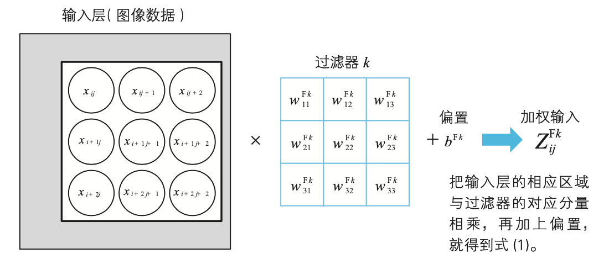

# 深度学习的数学

## ch1. 神经网络的思想

神经元(neuron)的加权输入:

$$
z = w_1x_1+w_2x_2+w_3x_3-\theta
$$

神经单元(unit)的一般化表达:

$$
y = a(w_1x_1+w_2x_2+w_3x_3+b)
$$

常见的激活函数(activation):
1. ReLU 系列:
   - ReLU
   - LeakyReLU
   - PReLU
   - ReLU6
   - RReLU
   - ELU
   - SELU
   - CELU
   - GELU

2. Sigmoid 系列:
   - Sigmoid
   - Hardsigmoid
   - LogSigmoid

3. Tanh 系列:
   - Tanh
   - Hardtanh
   - Tanhshrink

4. 其他非线性函数:
   - SiLU (Swish)
   - Mish
   - Softplus
   - Softsign
   - GLU (Gated Linear Unit)

5. 收缩函数:
   - Hardshrink
   - Softshrink

6. 阈值函数:
   - Threshold

7. 复合函数:
   - Hardswish

从数学角度看神经网络的学习，有监督学习:
- 为了确定神经网络的权重和偏置
- 给定学习数据来训练网络
- 损失函数为平方误差(统计学中回归分析的最小二乘法)

## ch2. 数学基础

- 一般函数，正太分布的概率密度函数
- 数列，递推关系式
- Sigma符号: $\Sigma$
- 向量方向和大小，内积
- 柯西-施瓦茨不等式: $-|\bm{a}||\bm{b}|<=\bm{a} \cdot \bm{b}<=|\bm{a}||\bm{b}|$
- 矩阵的和、差、常数倍、乘积、Hadamard 乘积、转置
- 导数: $f'(x) = \lim_{\Delta x \to 0} \frac{f(x + \Delta x) - f(x)}{\Delta x}$, $f'(x)=\frac{\mathrm{d}y}{\mathrm{d}x}$
- 单变量函数的最小值条件:
  - 当函数 $f(x)$ 在 $x = a$ 处取得最小值时，$f'(a) = 0$
- 偏导数: $\frac{\partial z}{\partial x} = \frac{\partial f(x,y)}{\partial x} = \lim_{\Delta x \to 0} \frac{f(x+\Delta x, y) - f(x,y)}{\Delta x}$
- 多变量函数的最小值条件:
  - $z = f(x, y)$ 取得最小值的必要条件是 $\frac{\partial f}{\partial x} = 0, \frac{\partial f}{\partial y} = 0$
- 求有约束条件下的极值: 拉格朗日乘数法

$$
\begin{aligned}
& \text{最优化：} & f(x, y, z) \\
& \text{约束条件：} & g(x, y, z) = 0 \\
& \text{拉格朗日函数：} & L(x, y, z, \lambda) = f(x, y, z) + \lambda g(x, y, z) \\
& \text{必要条件：} & \frac{\partial L}{\partial x} = 0, \frac{\partial L}{\partial y} = 0, \frac{\partial L}{\partial z} = 0, \frac{\partial L}{\partial \lambda} = 0
\end{aligned}
$$

- 复合函数求导的链式法则
  - 单变量函数: 
    $$
    \frac{d}{dx}[f(g(x))] = f'(g(x)) \cdot g'(x)
    $$
    
    更一般的形式：
    $$
    \frac{d}{dx}[f(g(h(x)))] = f'(g(h(x))) \cdot g'(h(x)) \cdot h'(x)
    $$

  - 多变量函数: 
    $$
    \begin{aligned}
    & \text{对于} z = f(u, v), \text{其中} u = g(x, y) \text{ 和 } v = h(x, y):\\[2ex]
    & \frac{\partial z}{\partial x} = \frac{\partial f}{\partial u} \cdot \frac{\partial g}{\partial x} + \frac{\partial f}{\partial v} \cdot \frac{\partial h}{\partial x} \\[2ex]
    & \frac{\partial z}{\partial y} = \frac{\partial f}{\partial u} \cdot \frac{\partial g}{\partial y} + \frac{\partial f}{\partial v} \cdot \frac{\partial h}{\partial y}
    \end{aligned}
    $$

    梯度形式：
    $$
    \nabla f(g(\mathbf{x})) = J_g(\mathbf{x})^T \nabla f(g(\mathbf{x}))
    $$
    其中，$J_g$ 是函数 $g$ 的雅可比矩阵，$\mathbf{x}$ 是变量向量。

- 多变量函数的近似公式:
$$
\Delta z \cong \frac{\partial z}{\partial w} \Delta w + \frac{\partial z}{\partial x} \Delta x + \frac{\partial z}{\partial y} \Delta y
$$

$$
\nabla z \cong \left( \frac{\partial z}{\partial w}, \frac{\partial z}{\partial x}, \frac{\partial z}{\partial y} \right), \quad \Delta \mathbf{x} = (\Delta w, \Delta x, \Delta y)
$$

- 泰勒展开式:
$$
\begin{aligned}
f(x) &= f(a) + f'(a)(x-a) + \frac{f''(a)}{2!}(x-a)^2 + \frac{f'''(a)}{3!}(x-a)^3 + \cdots \\
&= \sum_{n=0}^{\infty} \frac{f^{(n)}(a)}{n!}(x-a)^n
\end{aligned}
$$

$$
\begin{aligned}
f(x,y) &= f(a,b) + \frac{\partial f}{\partial x}(a,b)(x-a) + \frac{\partial f}{\partial y}(a,b)(y-b) \\
&+ \frac{1}{2!}\left[\frac{\partial^2 f}{\partial x^2}(a,b)(x-a)^2 + 2\frac{\partial^2 f}{\partial x\partial y}(a,b)(x-a)(y-b) + \frac{\partial^2 f}{\partial y^2}(a,b)(y-b)^2\right] \\
&+ \frac{1}{3!}\left[\frac{\partial^3 f}{\partial x^3}(a,b)(x-a)^3 + 3\frac{\partial^3 f}{\partial x^2\partial y}(a,b)(x-a)^2(y-b) \right. \\
&\left. + 3\frac{\partial^3 f}{\partial x\partial y^2}(a,b)(x-a)(y-b)^2 + \frac{\partial^3 f}{\partial y^3}(a,b)(y-b)^3\right] \\
&+ \cdots
\end{aligned}
$$

- 梯度下降法: 设 $\eta$ 为正的微小常数，变量 $x_1, x_2, \cdots, x_n$ 改变为 $x_1 + \Delta x_1, x_2 + \Delta x_2, \cdots, x_n + \Delta x_n$，当满足以下关系式时，函数 $f$ 减小得最快。

$$
(\Delta x_1, \Delta x_2, \cdots, \Delta x_n) = -\eta \left( \frac{\partial f}{\partial x_1}, \frac{\partial f}{\partial x_2}, \cdots, \frac{\partial f}{\partial x_n} \right) = -\eta \nabla f
$$

## ch3. 最优化

### 神经网络的变量的矩阵表示

$$
\begin{pmatrix}
z_1^3 \\
z_2^3
\end{pmatrix}
=
\begin{pmatrix}
w_{11}^3 & w_{12}^2 & w_{13}^3 \\
w_{21}^3 & w_{22}^3 & w_{23}^3
\end{pmatrix}
\begin{pmatrix}
a_1^2 \\
a_2^2 \\
a_3^2
\end{pmatrix}
+
\begin{pmatrix}
b_1^3 \\
b_2^3
\end{pmatrix}
$$

### 交叉熵 CrossEntropy

对于离散概率分布：

$$
H(p,q) = -\sum_{x \in \mathcal{X}} p(x) \log q(x)
$$

对于连续概率分布：

$$
H(p,q) = -\int_{\mathcal{X}} p(x) \log q(x) dx
$$

在二分类问题中，交叉熵常表示为：

$$
H(y, \hat{y}) = -[y \log(\hat{y}) + (1-y) \log(1-\hat{y})]
$$

对于多分类问题，使用One-Hot编码时的交叉熵：

$$
H(y, \hat{y}) = -\sum_{i=1}^{C} y_i \log(\hat{y}_i)
$$

其中：
- $p(x)$ 是真实概率分布
- $q(x)$ 是预测概率分布
- $y$ 是真实标签
- $\hat{y}$ 是预测概率
- $C$ 是类别数量

### 梯度下降法

神经网络的参数(权重和偏置)是通过将代价函数最小化来确定的:

$$
(\Delta w_{11}^2, \cdots, \Delta w_{11}^3, \cdots, \Delta b_1^2, \cdots, \Delta b_1^3, \cdots) \\
= -\eta \left( \frac{\partial C_T}{\partial w_{11}^2}, \cdots, \frac{\partial C_T}{\partial w_{11}^3}, \cdots, \frac{\partial C_T}{\partial b_1^2}, \cdots, \frac{\partial C_T}{\partial b_1^3}, \cdots \right)
$$

但是实际的计算十分困难，容易出现导数爆炸 => 推出误差方向传播方法

## ch4. 误差反向传播法

神经单元误差(error):

$$
\delta_j^l = \frac{\partial C}{\partial z_j^l} \quad (l = 2, 3, \cdots)
$$

$$
\frac{\partial C}{\partial w_{ji}^l} = \delta_j^l a_i^{l-1}, \quad \frac{\partial C}{\partial b_j^l} = \delta_j^l \quad (l = 2, 3, \cdots)
$$

误差反向传播与梯度下降法的关系:

误差反向传播法: 只需要求出输出层的神经单元误差

$$
\delta_i^2 = (\delta_1^3 w_{1i}^3 + \delta_2^3 w_{2i}^3) a'(z_i^2) \quad (i = 1, 2, 3)
$$

## ch5. CNN

CNN 图解:

卷积神经网络所需的变量、参数的符号及其含义汇总:

卷积操作:

池化操作:
- Max pooling
- Average pooling
- L2 pooling

全连接操作:

损失函数计算:

损失函数的梯度:

神经单元误差计算:

计算输出层损失:

$$
\delta_n^O = \frac{\partial C}{\partial z_n^O} = \frac{\partial C}{\partial a_n^O} \frac{\partial a_n^O}{\partial z_n^O} = \frac{\partial C}{\partial a_n^O} a'(z_n^O)
$$

$$
\frac{\partial C}{\partial a_n^O} = a_n^O - t_n \quad (n = 1, 2, 3)
$$

代入，就得到了输出层的神经单元误差 $\delta_O$。

$$
\delta_n^O = (a_n^O - t_n) a'(z_n^O) \tag{17}
$$

用误差表示输出层单元的梯度分量:

$$
\frac{\partial C}{\partial w_{k-ij}^{On}} = \delta_n^O a_{ij}^{Pk}, \quad \frac{\partial C}{\partial b_n^O} = \delta_n^O
$$

用误差表示关于卷积层神经单元的梯度分量:

误差反向传递:

$$
\delta_{ij}^{Fk} = \{\delta_1^O w_{k-i'j'}^{O1} + \delta_2^O w_{k-i'j'}^{O2} + \delta_3^O w_{k-i'j'}^{O3}\} \\
\times (\text{当} \, a_{ij}^{Fk} \text{在区块中最大时为1，否则为0}) \times a'(z_{ij}^{Fk})
$$

