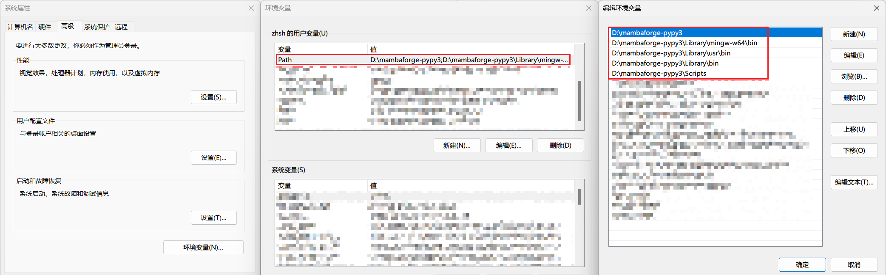

# Miniforge

## miniforge

Mirror: https://mirror.tuna.tsinghua.edu.cn/help/anaconda/
Install: https://conda-forge.org/miniforge/
Choose: Mambaforge-pypy3-Windows
Environment Variable:




## package install

```bash
mamba install -y -c pytorch -c nvidia pytorch torchvision torchaudio pytorch-cuda=12.1

pip install -U huggingface_hub
mamba install -y -c conda-forge -c huggingface transformers datasets tokenizers nltk spacy scikit-learn numpy pandas matplotlib seaborn jupyterlab tqdm

pip install bertviz
```

## Hugging Face

```bash
export HF_ENDPOINT=https://hf-mirror.com
huggingface-cli download --resume-download shenzhi-wang/Llama3-8B-Chinese-Chat --local-dir .
```

```powershell
setx HF_ENDPOINT https://hf-mirror.com
$env:HF_ENDPOINT = "https://hf-mirror.com"
```
