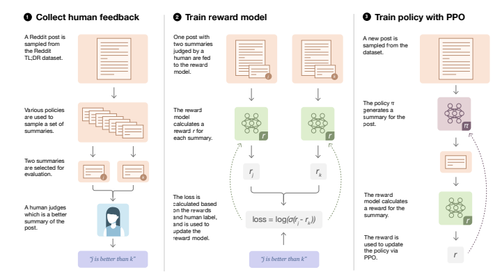
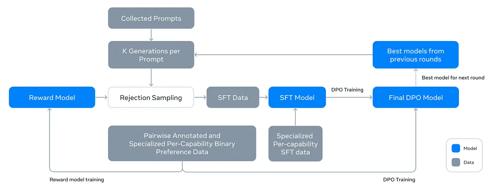
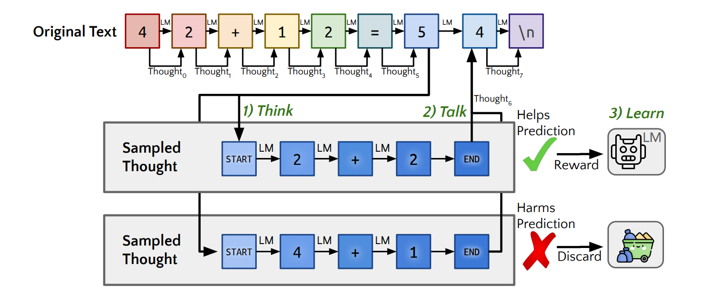

# OpenAI o1-preview|mini

- [Introducing OpenAI o1-preview](https://openai.com/index/introducing-openai-o1-preview/)
- [Learning to Reason with LLMs](https://openai.com/index/learning-to-reason-with-llms/)
- [o1-mini](https://openai.com/index/openai-o1-mini-advancing-cost-efficient-reasoning/)
- [o1 System Card](https://openai.com/index/openai-o1-system-card/)

## 关键创新

- Training: RL with scaling law
- Infering: CoT

## 技术路线

- ChatGPT: RLHF 基于人类反馈的强化学习

- LLaMA3.1: DPO 直接偏好优化

- Quiet-STaR: 解释性内部思考，增加模型思考能力(reasoning)

