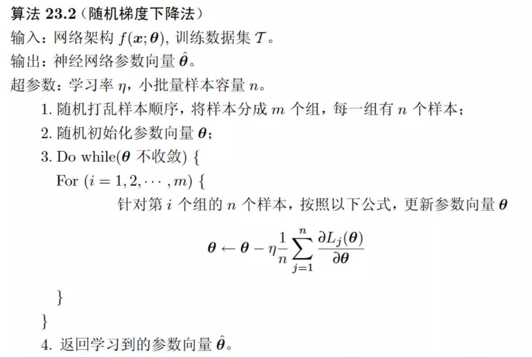
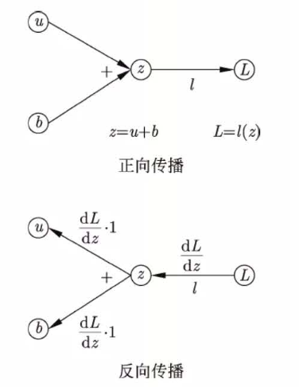

- [监督学习](#监督学习)
  - [ML和监督学习概论](#ml和监督学习概论)
    - [What is ML](#what-is-ml)
    - [机器学习的基本分类](#机器学习的基本分类)
      - [有监督学习](#有监督学习)
      - [无监督学习](#无监督学习)
      - [强化学习](#强化学习)
      - [半监督学习 \& 主动学习](#半监督学习--主动学习)
    - [按模型分类](#按模型分类)
      - [概率与非概率模型](#概率与非概率模型)
    - [按算法分类](#按算法分类)
    - [按技巧分类](#按技巧分类)
      - [贝叶斯学习](#贝叶斯学习)
      - [核方法](#核方法)
    - [机器学习方法三要素](#机器学习方法三要素)
      - [模型](#模型)
      - [策略](#策略)
      - [算法](#算法)
    - [模型评估与模型选择](#模型评估与模型选择)
    - [正则化](#正则化)
    - [交叉验证](#交叉验证)
    - [泛化能力](#泛化能力)
    - [生成模型与判别模型](#生成模型与判别模型)
    - [有监督学习应用](#有监督学习应用)
  - [感知机 Perceptron](#感知机-perceptron)
    - [感知机模型](#感知机模型)
    - [感知机学习策略](#感知机学习策略)
    - [感知机学习算法](#感知机学习算法)
      - [感知机学习算法的原始形式](#感知机学习算法的原始形式)
      - [算法的收敛性](#算法的收敛性)
      - [感知机学习算法的对偶形式](#感知机学习算法的对偶形式)
    - [感知机相关问题](#感知机相关问题)
  - [k 近邻](#k-近邻)
    - [KNN 算法](#knn-算法)
    - [KNN 模型](#knn-模型)
    - [KNN 的实现: kd Tree](#knn-的实现-kd-tree)
  - [朴素贝叶斯](#朴素贝叶斯)
    - [朴素贝叶斯基础](#朴素贝叶斯基础)
    - [极大似然估计](#极大似然估计)
    - [朴素贝叶斯算法](#朴素贝叶斯算法)
    - [贝叶斯估计](#贝叶斯估计)
  - [决策树](#决策树)
    - [决策树的学习](#决策树的学习)
    - [信息增益: 熵(Entropy)](#信息增益-熵entropy)
    - [决策树的生成](#决策树的生成)
      - [ID3](#id3)
      - [C4.5](#c45)
  - [逻辑斯谛回归与最大熵模型](#逻辑斯谛回归与最大熵模型)
  - [支持向量机](#支持向量机)
  - [Boosting](#boosting)
  - [EM 算法及其推广](#em-算法及其推广)
  - [隐马尔可夫模型](#隐马尔可夫模型)
  - [条件随机场](#条件随机场)
  - [监督学习总结](#监督学习总结)
- [无监督学习](#无监督学习-1)
- [深度学习](#深度学习)
  - [前馈神经网络](#前馈神经网络)
    - [MLP定义](#mlp定义)
    - [MLP的表示能力](#mlp的表示能力)
    - [MLP学习算法](#mlp学习算法)
      - [一般形式](#一般形式)
      - [回归的形式](#回归的形式)
      - [二分类的形式](#二分类的形式)
      - [多分类的形式](#多分类的形式)
    - [MLP学习的优化算法](#mlp学习的优化算法)
    - [计算图上的实现](#计算图上的实现)
    - [算法实现技巧](#算法实现技巧)
      - [梯度消失 \& 梯度爆炸](#梯度消失--梯度爆炸)
      - [批量归一化](#批量归一化)
      - [层归一化](#层归一化)
    - [正则化](#正则化-1)
      - [早停机制](#早停机制)
      - [暂退机制](#暂退机制)
  - [卷积神经网络](#卷积神经网络)
  - [循环神经网络](#循环神经网络)
    - [简单循环神经网络 S-RNN](#简单循环神经网络-s-rnn)
      - [学习算法](#学习算法)
    - [长短期记忆网络 LSTM](#长短期记忆网络-lstm)
      - [LSTM 定义](#lstm-定义)
      - [LSTM 网络结构](#lstm-网络结构)
      - [LSTM 单元结构](#lstm-单元结构)
      - [LSTM 模型特点](#lstm-模型特点)
    - [门控循环单元网络 GRU](#门控循环单元网络-gru)
    - [深度循环神经网络](#深度循环神经网络)
    - [双向循环神经网络](#双向循环神经网络)
    - [NLP的应用](#nlp的应用)
      - [词向量](#词向量)
  - [序列到序列模型](#序列到序列模型)
  - [预训练语言模型](#预训练语言模型)
  - [生成对抗网络](#生成对抗网络)

---

# 监督学习

## ML和监督学习概论

### What is ML

基础知识

- ML：基于数据，构建概率模型，运行模型对数据进行预测与分析
- 学习：系统，通过执行某个过程，改进其性能
- 特点：建立在计算机&网络上的，数据驱动(对象)，对数据进行预测和分析(目的)，交叉学科
- 数据：文本，图形，视频，音频
- 方法：有监督学习，无监督学习，强化学习(reinforcement learning)

ML 三要素  
- 模型 model
- 策略 strategy
- 算法 algorithm

ML 可以概括为  
- 从给定的、有限的、用于学习的训练数据集合出发
- 假设数据是独立同分布产生的(每个样本都是相互独立&遵循相同的概率分布)
- 假设要学习的模型属于某个函数的集合(即假设空间 hypothesis space)
- 应用某个评价标准(evaluation critetion)，从假设空间中选出一个最优模型，使其对已知训练数据&未知测试数据有最优预测
- 最优模型的选取由算法实现

ML 的研究  
- 方法：开发新的方法
- 理论：探索ML方法的有效性&效率&基本理论问题
- 应用：垂直领域解决问题

计算机科学的三维组成  
- 系统
- 计算
- 信息(ML here)

### 机器学习的基本分类

#### 有监督学习

- 从标注数据中学习预测模型
- 本质：学习输入到输出的映射的统计规律
- 概念：输入空间，输出空间，实例，特征向量，特征空间；训练数据，测试数据，样本
- 假设：输入和输出的随机变量遵循联合概率分布 $P(X,Y)$ 表示分布(密度)函数
  - 学习过程中，假设的联合概率分布虽然存在，但是学习系统是不知道具体定义的
  - 训练&测试数据被看作是联合概率分布独立同分布产生的
- 目的：学习一个最好的输入到输出的映射(即，模型)
- 假设空间：由输入空间到输出空间的映射的集合
- 模型可以是概率模型or非概率模型，由条件概率分布 $P(X,Y)$ or 决策函数 $Y=f(X)$ 表示
- 预测：对具体的输入 $P(y|x)$ or $y=f(x)$

监督学习的过程：学习，预测


#### 无监督学习

- 从无标注数据中学习预测模型
- 本质：学习数据中的统计规律或潜在结构
- 输入：特征向量；输出：对输入的分析结果，由输入的类别、转换或概率表示
- 作用：对数据的聚类，降维，概率估计
- 假设 $X$ 是输入空间 $Z$ 是隐式结构空间，要学习的模型可以表示为 ( $x\in X$ , $z\in Z$ )
  - 函数 $z=g(x)$
  - 条件概率分布 $P(z|x)$
  - 条件概率分布 $P(x|z)$

无监督学习的过程：学习，预测


#### 强化学习

- 在与环境的连续互动中学习最优行为策略
- 假设智能系统与环境的互动基于马尔可夫决策过程(Markov decision process)
- 智能系统能观测到的是与环境互动得到的数据序列
- 本质：学习最优的序贯决策
- 强化学习的MDP：状态、奖励、动作序列上的随机过程，由四元组 $\langle S,A,P,r \rangle$ 组成


[!] 这里还需要更深入的理解。

#### 半监督学习 & 主动学习

半监督学习  
- 利用大量未标注数据中的信息，辅助少量标注数据，进行监督
- 解决人工标注成本问题

主动学习  
- 机器不断主动给出实例让教师进行标注
- 利用标注数据让学生学习预测模型的机器学习问题

### 按模型分类

#### 概率与非概率模型

- 概率模型(Probabilistic model)
  - 决策树
  - 朴素贝尔斯
  - 隐马尔可夫模型
  - 条件随机场
  - 概率潜在语义分析
  - 潜在迪利克雷分类
  - 高斯混合模型
- 非概率模型(Non-probabilistic model)
  - 感知机
  - 支持向量机
  - k近邻
  - AdaBoost
  - k均值
  - 潜在语义分析
  - 神经网络
- 逻辑斯谛回归(both)

主要区别  
- 内在结构
- 概率模型可以表示为联合概率分布的形式，变量表示输入、输出、隐变量、参数
- 非概率模型不存在这样的联合概率分布

- 有监督学习
  - 概率模型: $P(y|x)$
  - 非概率模型: $y=f(x)$
- 无监督学习
  - 概率模型: $P(z|x)$ or $P(x|z)$
  - 非概率模型: $y=g(x)$

概率模型的推理，随机变量( $x$, $y$ )  
- 加法规则: $P(x)=\sum_y P(x,y)$
- 乘法规则: $P(x,y)=P(x)P(y|x)$

线性与非线性模型  
- 线性模型：感知机，线性支持向量机，k近邻，k均值，潜在语义分析
- 非线性模型：核函数支持向量机，AdaBoost，神经网络

参数化与非参数化模型  
- Parametric Model: 模型参数的维度固定，可以由有限维度参数完全刻画
- Non-parametric Model: 模型参数的维度不固定(无穷大)，随着训练数据量增加而增加

### 按算法分类

- 在线学习(online learning): 每次接受一个样本
- 批量学习(batch learning): 每次接受批量样本


### 按技巧分类

#### 贝叶斯学习

- 在概率模型的学习和推理中，利用贝叶斯定义，计算在给定数据条件下模型的条件概率（后验概率），应用这个原理进行模型的估计，对数据的预测
- 将模型、未观测要素及其参数用变量表示，使用模型的先验分布

假设随机变量 D 表示数据，随机变量 $\theta$ 表示模型参数，根据贝叶斯定理，用以下公式计算后验概率

$$P(\theta|D)=\frac{P(\theta)P(D|\theta)}{P(D)}$$

其中，

- $P(\theta)$ 先验概率
- $P(D|\theta)$ 似然函数

预测时，计算数据对后验概率分布的期望值：

$$P(x|D) = \int P(x|\theta, D)P(\theta|D)d\theta$$

贝叶斯估计和极大似然估计比较：


#### 核方法

Kernel method: 使用核函数表示和学习非线性模型
- 核方法可以把线性模型扩展到非线性模型学习
- 方法：显示地定义从输入空间（低维空间）到特征空间（高维空间）的映射，在特征空间中内积计算
- SVM：把输入空间的线性不可分问题转换为特征空间的线性可分问题
- 技巧：不显式定义映射，定义核函数

表示定理

假设 $x_1$ 和 $x_2$ 是输入空间的任意两个实例（向量），其内积是 $\langle x_1, x_2 \rangle$。假设从输入空间到特征空间的映射是 $\varphi$，那么 $x_1$ 和 $x_2$ 在特征空间的映像分别是 $\varphi(x_1)$ 和 $\varphi(x_2)$，它们的内积是 $\langle \varphi(x_1), \varphi(x_2) \rangle$。核方法直接在输入空间中定义核函数 $K(x_1, x_2)$，使其满足：

$$K(x_1, x_2) = \langle \varphi(x_1), \varphi(x_2) \rangle$$

这个表示定理给出了核函数成立的充要条件。核函数 $K(x_1, x_2)$ 实际上计算的是特征空间中两个向量的内积，但不需要显式地知道映射函数 $\varphi$ 的具体形式。

1. 避免了在高维特征空间中的直接计算
2. 允许在原始输入空间中进行计算，同时获得非线性变换的好处
3. 可以处理各种类型的数据，包括向量、字符串、图像等

### 机器学习方法三要素

$$方法 = 模型+策略+算法$$

#### 模型

函数集合定义:

- 决策函数

$$
F = \{f|Y=f_\theta(X), \theta \in R^n\}
$$

- 条件概率

$$
F = \{P|P_\theta(Y|X), \theta \in R^n\}
$$

#### 策略

预测的度量  
- 损失函数：度量模型一次预测的好坏
- 风险函数(期望损失)：度量模型平均意义下预测的好坏

经验风险|损失(empirical risk|loss)：模型关于训练数据集的平均损失

$$
R_emp(f) = \frac{1}{N} \sum_{i=1}^N L(y_i,f(x_i))
$$

结构风险|损失()：

$$
R_srm(f) = \frac{1}{N} \sum_{i=1}^N L(y_i,f(x_i)) + \lambda J(f)
$$

基本策略  
- 经验风险最小化：样本容量足够大时，有很好的学习效果 e.g. 极大似然估计(maximum likelihood estimation)
- 结构风险最小化：在经验风险的基础上表示模型复杂度的正则化项(regulation)or惩罚项(penalty term)，防止过拟合 e.g. 最大后验概率估计

#### 算法

- 机器学习基于训练数据集，根据学习策略，从假设空间中选择最优模型，选择计算方法求解最优模型
- ML归结为最优化问题，ML算法为最优化问题的算法
- 重点问题：如何找到全局最优解，并且求解过程非常高效

### 模型评估与模型选择

- 训练误差(调参优化) & 测试误差(泛化能力)
- 过拟合：所选模型的复杂度比真模型更高

### 正则化

正则化：模型复杂度的单调递增函数，可以是模型参数向量( $w$ )的范数

- 奥卡姆剃刀原理(Occam's razor)：在所有可能选择的模型中，能很好解释已知数据并十分简单才是最好的模型
- 贝叶斯估计角度：正则化项=模型的先验概率；复杂模型先验概率小，简单模型先验概率大

模型参数向量的范数选择

- L1范数

$$\lambda \frac{||w||^2}{2}$$

- L2范数

$$\lambda||w||_1$$

### 交叉验证

- 如果样本充足，切分为 training dataset, validation, test
- 交叉验证，重复使用数据

S-折交叉验证(S-fold cross validation)  
- 随机将数据集切分为S个互不相交、大小相同的子集
- 利用S-1个子集数据训练，1个子集测试模型
- 重复这个过程，选出S次评测中平均测试误差最小的模型

### 泛化能力

方法的泛化能力指的是该方法学习到的模型对未知数据的预测能力

泛化误差的定义：如果学到的模型是 $\hat{f}$，那么用这个模型对未知数据预测的误差即为泛化误差（generalization error）：

$$R_{\exp}(\hat{f}) = E_P[L(Y, \hat{f}(X))]$$

$$= \int_{\mathcal{X}\times\mathcal{Y}} L(y, \hat{f}(x))P(x,y)dxdy \qquad (1.27)$$

在这个表达式中：
- $R_{\exp}(\hat{f})$ 表示期望风险（泛化误差）
- $E_P$ 表示关于联合分布 $P(X,Y)$ 的期望
- $L(Y, \hat{f}(X))$ 是损失函数
- $\mathcal{X}$ 和 $\mathcal{Y}$ 分别表示输入空间和输出空间
- $P(x,y)$ 是 $X$ 和 $Y$ 的联合概率密度函数

### 生成模型与判别模型

1. 生成模型 (Generative Model):
   - 生成模型学习联合概率分布 P(X,Y)，然后求出条件概率分布 P(Y|X) 作为预测模型。
   - 它能够描述给定输入 X 产生输出 Y 的生成关系。
   - 生成模型的例子包括朴素贝叶斯法和隐马尔可夫模型。
   - 特点：
     - 可以还原出联合概率分布 P(X,Y)
     - 学习收敛速度较快，尤其是在样本容量增加时
     - 可以处理存在隐变量的情况

2. 判别模型 (Discriminative Model):
   - 判别模型直接学习决策函数 f(X) 或条件概率分布 P(Y|X)。
   - 它关注于对给定输入 X，应该预测什么样的输出 Y。
   - 判别模型的例子包括k近邻法、感知机、逻辑斯蒂回归模型、最大熵模型、支持向量机等。
   - 特点：
     - 直接面对预测，往往学习的精确率更高
     - 可以对数据进行各种程度的抽象，定义特征并使用特征
     - 可以简化学习问题

### 有监督学习应用

- 分类问题: $P(Y|X)$ or $Y=f(X)$
  - 分类情况: TP, FN, FP, TN
  - 性能指标: accuracy, precision, recall, f1
- 标注问题: $P(Y^{1},Y^{2},\cdots,Y^{n})|X^{1},X^{2},\cdots,X^{n}$
  - 指标和分类问题类似
  - 常用的方法：隐马尔可夫模型，条件随机场
- 回归问题: $Y=f(X)$ 等价于函数拟合，选择一条函数曲线使其很好地拟合已知数据且很好地预测未知数据
  - 常用损失函数：平凡损失函数；问题可以由由最小二乘法求解

## 感知机 Perceptron

- 在 1957 年由 Rosenblatt 提出
- 二分类线性分类模型，输入为特征向量，输出为实例的类别
- 感知机学习将实例划分为正负两类的线性划分的分离超平面，属于判别模型
- 使用基于误分类的损失函数，梯度下降法对损失函数最小化

### 感知机模型

假设输入空间（特征空间）是 $X \subseteq R^n$, 输出空间是 $Y=\{+1,-1\}$. 输入 $x \in X$ 表示实例的特征向量,对应于输入空间（特征空间）的点;输出 $y \in Y$ 表示实例的类别. 由输入空间到输出空间的如下函数

$$
f(x) = \text{sign}(w \cdot x + b)
$$

称为感知机. 其中, $w$ 和 $b$ 为感知机模型参数, $w \in R^n$ 叫作权值(weight)或权值向量(weight vector), $b \in R$ 叫作偏置(bias), $w \cdot x$ 表示 $w$ 和 $x$ 的内积. sign 是符号函数, 即

$$
\text{sign}(x) = \begin{cases}
+1, & x \geq 0 \\
-1, & x < 0
\end{cases}
$$

感知机模型的假设空间是特征空间中所有的线性分类模型(linear classification model)，即函数集合 $\{f|f(x)=w\cdot x+b\}$

感知机的集合解释：线性方程 $w\cdot x+b=0$ 对应于特征空间 $R^n$ 中的一个超平面(分离超平面 separating hyperplane) $S$ 其中 $w$ 是超平面的法向量 $b$ 是截距，空间划分为两个部分分别为正负类。

### 感知机学习策略

- 数据集线性可分: 存在某个超平面，完全正确划分两类到超平面两侧
- 学习策略，定义经验损失函数并且最小化: 选择的损失函数要是参数 $w, b$ 的连续可导
  - 即，误分类点到超平面 S 的总距离

假设 S 的误分类点集合为 M，所有误分类点到 S 的总距离为

$$
-\frac{1}{||w||}\sum_{x_i \in M}y_i(w \cdot x_i+b)
$$

"函数间隔"是机器学习中的一个重要概念，尤其在支持向量机(SVM)中常见。它衡量的是模型对某个样本点分类的确信程度。函数间隔的绝对值越大，表示模型对这个样本分类越有信心。

简单来说，这个公式计算出的值反映了样本点到决策边界的距离，同时考虑了样本的真实类别。正值表示分类正确，负值表示分类错误，绝对值大小表示分类的确信度。这个概念在优化分类模型时非常重要，因为我们通常希望最大化所有样本点的函数间隔，以获得更好的分类效果。

因此，感知机 $sign(w\cdot x+b)$ 学习的损失函数定义为

$$
L(w,b)=-\sum_{x_i\in M}y_i(w\cdot x_i+b)
$$

感知机的学习策略：在假设空间中选取是损失函数最小的模型参数 $w,b$ 

### 感知机学习算法

训练数据集

$$
T=\{(x_1,y_1),(x_2,y_2),\cdots,(x_N,y_N)\}
$$

其中, $x_i\in X=R^n$, $y_i\in Y=\{-1,+1\}$, $i=1,2,\cdots,N$

#### 感知机学习算法的原始形式

学习算法是误分类驱动的，采用 SGD: 任取一个超平面 $w_0,b_0$ 使用 SGD 不断极小化目标函数；**注意**：极小化过程不是一次使 M 中所有误分类点的梯度下降，而是一次随机选取一个误分类点使其梯度下降

假设误分类点集合 M 是固定的，L的梯度

$$
\triangledown_w L(w,b) = -\sum_{x_i\in M}y_ix_i  \\
\triangledown_b L(w,b) = -\sum_{x_i\in M}y_i
$$

随机选取一个误分类点 $(x_i,y_i)$ 对 $w,b$ 进行更新

$$
w \leftarrow w + \eta y_ix_i  \\
b \leftarrow b + \eta y_i
$$

算法伪代码如下:

> 输入: 训练数据集 T = {(x1, y1), (x2, y2), ..., (xN, yN)}, 其中 xi ∈ X = R^n, yi ∈ Y = {-1, +1}, i = 1, 2, ..., N; 学习率 η (0 < η ≤ 1)。
> 输出: w, b; 感知机模型 f(x) = sign(w · x + b)。
> 算法步骤:
> 1. 选取初值 w0, b0;
> 2. 在训练集中选取数据 (xi, yi);
> 3. 如果 yi(w · xi + b) ≤ 0, 则
>    w ← w + ηyixi
>    b ← b + ηyi
> 4. 转至步骤 (2), 直至训练集中没有误分类点。

#### 算法的收敛性

证明，对于线性可分数据集，感知机学习算法原始形式收敛（经过有限次迭代可以得到一个将训练数据集完全正确划分的分离超平面）

**定理 2.1 (Novikoff)**

设训练数据集 $T = \{(x_1, y_1), (x_2, y_2), \ldots, (x_N, y_N)\}$ 是线性可分的，其中 $x_i \in \mathcal{X} = \mathbb{R}^n$, $y_i \in \mathcal{Y} = \{-1,+1\}$, $i = 1, 2, \ldots, N$, 则

(1) 存在满足条件 $\|\hat{w}_{opt}\| = 1$ 的超平面 $\hat{w}_{opt} \cdot \hat{x} = w_{opt} \cdot x + b_{opt} = 0$ 将训练数据集完全正确分开；且存在 $\gamma > 0$, 对所有 $i = 1, 2, \ldots, N$, 有

$$
y_i(\hat{w}_{opt} \cdot \hat{x}_i) = y_i(w_{opt} \cdot x_i + b_{opt}) \geq \gamma
$$

(2) 令 $R = \max_{1\leq i\leq N} \|\hat{x}_i\|$, 则感知机算法 2.1 在训练数据集上的误分类次数 $k$ 满足不等式

$$
k \leq \left(\frac{R}{\gamma}\right)^2
$$

上述定理说明，误分类次数 k 是有上界的，即当数据线性可分，感知机学习算法原始形式迭代是收敛的；但是存在许多解，依赖于初值的选择和迭代过程中误分类点的选择损失。

为得到唯一的超平面，需要对分离超平面增加约束条件（线性支持向量机）；当训练集线性不可分时，感知机学习算法不收敛，迭代结果会震荡

#### 感知机学习算法的对偶形式

对偶形式的想法是：将 $w,b$ 表示为数据 $(x_i,y_i)$ 的线性组合形式，通过求解系数而求得 $w,b$ 。对误分类点通过梯度下降逐步修改模型参数，设修改 n 次，则参数的增量为 $\alpha_i y_ix_i, \alpha_i y_i$ 在这里 $\alpha_i=n_i\eta$ ，最后学习到的参数可以表示为

$$
w=\sum_{i=1}^N \alpha_i y_ix_i  \\
b=\sum_{i=1}^N \alpha_i y_i
$$


### 感知机相关问题

> Minsky 和 Papert 指出：感知机因为是线性模型，所以不能表示复杂的函数（例如XOR），为什么？

XOR 的数据集线性不可分

> **定理**: 样本集线性可分的充分必要条件是正实例点集所构成的凸壳与负实例点集所构成的凸壳互不相交。

凸壳 (Convex Hull) 的定义：
设集合 $S \subset \mathbb{R}^n$ 是由 $\mathbb{R}^n$ 中的 $k$ 个点所组成的集合，即 $S = \{x_1, x_2, \cdots, x_k\}$，定义 $S$ 的凸壳 $conv(S)$ 为：

$$
conv(S) = \left\{x = \sum_{i=1}^k \lambda_i x_i \bigg| \sum_{i=1}^k \lambda_i = 1, \lambda_i \geq 0, i = 1,2,\cdots,k \right\}
$$

证明:

1. 充分性：
   假设正实例点集的凸壳与负实例点集的凸壳互不相交。
   - 根据凸集分离定理，存在一个超平面能够将这两个凸壳分开。
   - 这个超平面就能够将正实例和负实例完全分开。
   - 因此，样本集是线性可分的。

2. 必要性：
   假设样本集是线性可分的。
   - 存在一个超平面 $w^T x + b = 0$ 能够将正实例和负实例完全分开。
   - 对于任意正实例 $x_+$，有 $w^T x_+ + b > 0$。
   - 对于任意负实例 $x_-$，有 $w^T x_- + b < 0$。
   - 假设正实例凸壳中的点 $p = \sum_{i=1}^m \alpha_i x_i^+$，其中 $\sum_{i=1}^m \alpha_i = 1, \alpha_i \geq 0$。
   - 则有：
     $w^T p + b = w^T (\sum_{i=1}^m \alpha_i x_i^+) + b = \sum_{i=1}^m \alpha_i (w^T x_i^+ + b) > 0$
   - 同理，对于负实例凸壳中的任意点 $q$，有 $w^T q + b < 0$。
   - 这说明正实例的凸壳完全位于超平面的一侧，负实例的凸壳完全位于超平面的另一侧。
   - 因此，两个凸壳互不相交。

综上所述，定理得证。

## k 近邻

KNN 是一种分类与回归方法。三要素为：

- k 值的选择
- 距离度量
- 分类决策

### KNN 算法

KNN 没有显示的学习过程


### KNN 模型

根据三要素（训练集、距离度量、k值、分类决策规则）确定 KNN 模型后，相当于将特征空间划分为子空间，确定子空间里的每个点所属的类

单元：对每个训练实例点，距离该点比其他点更近的所有点组成的区域；所有训练实例点的单元构成对特征空间的一个划分

距离度量：两个实例点相似程度  
- $L_p$ 距离
- p=1，曼哈顿距离 Manhattan distance
- p=2，欧氏距离 Euclidean distance
- p=inf，各个坐标最大值


k 值的选择  
- k 较小：增大学习估计误差，减少学习近似误差，模型更复杂，容易过拟合
- k 较大：减少学习估计误差，增大学习近似误差，模型更简单，容易欠拟合

分类决策规则  
- 多数表决规则 majority voting rule
- 多数表决规则等价于经验风险最小化

### KNN 的实现: kd Tree

KNN 主要问题：如何对训练数据进行快速 k 近邻搜索

构造 td 树

1. 开始构造根节点，选维度数值方差最大的作为起始
2. 重复：对深度为 j 的节点，选择 $x^{(I)} I=j mod k +1$ 作为切分轴，中位数切分
3. 直到两个子区域没有实例时停止

搜索 td 树

1. 寻找当前最近点：从根节点出发
2. 回溯：从该节点出发，更新当前最近节点，检查子节点的父节点的另一子节点对应的区域是否有更近的点（画圆圈看是否和超平面有交集）
3. 回退到根节点，搜索结束，最后当前最近点为 x 的最近邻点

## 朴素贝叶斯

### 朴素贝叶斯基础

贝叶斯定理

$$
P(Y=c_i|X=x)=\frac{P(X=x|Y=c_i)\cdot P(Y=c_i)}{\sum_{i=1}^K P(X=x|Y=c_i)\cdot P(Y=c_i)}
$$

贝叶斯分类

$$
P(Y = c_i|X = x) = \frac{P(X = x|Y = c_i) \cdot P(Y = c_i)}{\sum_{i=1}^K P(X = x|Y = c_i) \cdot P(Y = c_i)}  \\
\arg \max_{c_i} P(X = x|Y = c_i) \cdot P(Y = c_i)
$$

朴素 = 假设特征之间相互独立（条件独立性假设）

朴素贝叶斯分类

$$
P(Y = c_i|X = x) = \frac{P(Y = c_i) \prod_{j=1}^n P(X^{(j)} = x^{(j)}|Y = c_i)}{\sum_{i=1}^K P(Y = c_i) \prod_{j=1}^n P(X^{(j)} = x^{(j)}|Y = c_i)}  \\
\arg \max_{c_i} P(Y = c_i) \prod_{j=1}^n P(X^{(j)} = x^{(j)}|Y = c_i)
$$

0-1损失函数最小化 -> 期望风险最小化 = 后验概率最大化

$$
L(Y, f(X)) = \begin{cases}
1, & Y \neq f(X) \\
0, & Y = f(X)
\end{cases}  \\

R(f) = E[L(Y, f(X))]  \\

f(x) = \arg \max_{c_i} P(c_i|X = x)
$$

### 极大似然估计

极大似然估计：使似然函数（联合密度函数）达到最大的参数值

似然函数

$$
L(\beta)=L(x_1,\cdots,x_N;\beta)
$$

极大似然估计

$$
\hat{\beta} = \arg \max_{\beta \in \Theta} L(x_1, \cdots, x_N; \beta)
$$

### 朴素贝叶斯算法

先验概率 + 条件概率 => 后验概率 => 分类

### 贝叶斯估计

先验概率 -> 调整因子 -> 后验概率 

先验概率的贝叶斯估计

$$
P_\lambda(Y = c_k) = \frac{\sum_{i=1}^N I(y_i = c_k) + \lambda}{N + K\lambda}
$$

条件概率的贝叶斯估计

$$
P_\lambda(X^{(j)} = a_{jl}|Y = c_k) = \frac{\sum_{i=1}^N I(x_i^{(j)} = a_{jl}, y_i = c_k) + \lambda}{\sum_{i=1}^N I(y_i = c_k) + S_j\lambda}
$$

注：$\lambda \geq 0$，$\lambda = 0$时为极大似然估计，$\lambda = 1$时为拉普拉斯平滑(Laplacian Smoothing)。

## 决策树

人类两大思维：归纳法（决策树），演绎法（第一性原理）

决策树是通过一系列if-then规则对数据进行分类的过程

- 决策树：给定特征条件下类的 $P(Y|X)$
- 条件概率分布：特征空间的一个划分 Partition
- 划分：单元 Cell 或区域 Region 互不相交

### 决策树的学习

- 本质：从训练数据集中归纳出一组分类规则，与训练数据集不相矛盾
- 假设空间：由无穷多个条件概率模型构成
- 什么是好的DT：训练中拟合较好，同时泛化性较好
- 策略：最小化损失函数
- 特征选择：递归选择最优特征
- 生成：特征空间的划分，直到所有训练子集被正确分类
- 剪枝：避免过拟合

### 信息增益: 熵(Entropy)

熵表示随机变量不确定性

$$
H(p)=-\sum_{i=1}^n p_i \log p_i
$$

随机变量取值等概率分布，熵最大

$$
0 <= H(p) <= \log n
$$

条件熵

$$
H(Y|X)=-\sum_{i=1}^n p_i H(Y|X=x_i)  \\
p_i=P(X=x_i)
$$

数据估计得到的为：经验熵，经验条件熵

信息增益：得知特征 X 而使类 Y 的信息的不确定性减少的程度

$$
g(D,A)=H(D)-H(D|A)
$$

信息增益比：解决取值数量多与少影响熵值的情况

$$
g_R(D,A) = \frac{g(D,A)}{H_A(D)}  \\
H_A(D) = -\sum_{k=1}^K \frac{|D_k|}{|D|} \log_2 \frac{|D_k|}{|D|}
H(D) = -\sum_{k=1}^K \frac{|C_k|}{|D|} \log_2 \frac{|C_k|}{|D|}
$$

### 决策树的生成

#### ID3

```pseudocode
输入: 训练数据集 D, 特征集 A, 阈值 ε
输出: 决策树 T

函数 构建决策树(D, A, ε):
    如果 D 中所有实例属于同一类:
        T = 创建叶节点(类别 = D中实例的类别)
        返回 T
    
    如果 D 中所有实例无任何特征 (A = ∅):
        T = 创建叶节点(类别 = D中实例数最多的类别)
        返回 T
    
    对于 A 中每个特征 a:
        计算信息增益 Gain(D, a)
    
    Ag = 信息增益最大的特征
    
    如果 Gain(D, Ag) < ε:
        T = 创建叶节点(类别 = D中实例数最多的类别)
        返回 T
    
    否则:
        T = 创建内部节点(特征 = Ag)
        对于 Ag 的每个可能值 ai:
            Di = D 中 Ag = ai 的子集
            Ti = 构建决策树(Di, A - {Ag}, ε)
            将 Ti 作为 T 的子树添加
        返回 T

T = 构建决策树(D, A, ε)
返回 T
```

#### C4.5

## 逻辑斯谛回归与最大熵模型

## 支持向量机

## Boosting

## EM 算法及其推广

## 隐马尔可夫模型

## 条件随机场

## 监督学习总结

# 无监督学习

# 深度学习

## 前馈神经网络

主要用于监督学习: feedforward neural network, multilayer perceptron, deep neural network (layer>2)

- 整个神经网络是对多个输入信号进行多次非线形转换产生多个输出信号的复合函数
- 学习算法：反向传播 BP
- 损失函数：分类=交叉熵，回归=平方损失，最小化等价于极大似然估计
- 正则化方法：L2, dropout, early stopping

### MLP定义

神经元的定义

$$
y = f(x_1, x_2, \cdots, x_n) = a\left(\sum_{i=1}^n w_i x_i + b\right)
$$

- x: input
- y: output
- z: intermediate output, net input
- w, b: weight, bias
- a: activation function

向量表示

$$
y=f(x)=a(\bold{w}^T x+b)
$$

MLP第一层的神经元的定义

$$
h_j^{(1)} = a\left(z_j^{(1)}\right) = a\left(\sum_{i=1}^n w_{ji}^{(1)} x_i + b_j^{(1)}\right), \quad j = 1,2,\ldots,m
$$

MLP结构


矩阵表示

$$
h^{(1)} = f^{(1)}(x) = a(z^{(1)}) = a\left(W^{(1)\mathrm{T}}x + b^{(1)}\right)  \\
y = f^{(2)}\left(h^{(1)}\right) = g(z^{(2)}) = g\left(W^{(2)\mathrm{T}}h^{(1)} + b^{(2)}\right)
$$

多层MLP神经元定义，第 t 层的第 j 个神经元

$$
h_j^{(t)} = a\left(z_j^{(t)}\right) = a\left(\sum_{i=1}^n w_{ji}^{(t)} h_i^{(t-1)} + b_j^{(t)}\right), \quad j = 1,2,\ldots,m
$$

多层MLP矩阵表示

$$
\begin{cases}
h^{(1)} = f^{(1)}(x) = a(z^{(1)}) = a\left(W^{(1)\mathrm{T}}x + b^{(1)}\right) \\
h^{(2)} = f^{(2)}(h^{(1)}) = a(z^{(2)}) = a\left(W^{(2)\mathrm{T}}h^{(1)} + b^{(2)}\right) \\
\vdots \\
h^{(s-1)} = f^{(s-1)}(h^{(s-2)}) = a(z^{(s-1)}) = a\left(W^{(s-1)\mathrm{T}}h^{(s-2)} + b^{(s-1)}\right) \\
y = h^{(s)} = f^{(s)}(h^{(s-1)}) = g(z^{(s)}) = g\left(W^{(s)\mathrm{T}}h^{(s-1)} + b^{(s)}\right)
\end{cases}
$$

常见激活函数

- Sigmoid: $a(z)=\frac{1}{1+e^{-z}}$ , $a'(z)=a(z)(1-a(z))$
- tanh: $a(z)=\frac{e^z-e^{-z}}{e^z+e^{-z}}$ , $a'(z)=1-a(z)^2$
- ReLU: $a(z)=\max(0,z)$ , $a'(z)=\begin{cases}1 & \text{if } z > 0 \\ 0 & \text{if } z \leq 0\end{cases}$

激活函数：左饱和，右饱和，饱和

模型

- 回归: $y=f(x)$ 一维输出层，输出一个实数值
- 二分类: $p=P(y=1|x)=f(x), y\in {0,1}$
- 多分类: $p=\[P(y_k=1|x)\]=f(x), y\in {0,1}, k=1,2,\ldots,l$ 输出l个概率值组成的概率向量
- 多标签分类: $p=\[P(y_k=1|x)\]=f(x), y\in {0,1}, k=1,2,\ldots,l$ 输出l个神经元，每个神经元的输出是一个概率值

输出层神经元

- 回归: $y = g(z) = z, z = w^{(s)T}h^{(s-1)} + b^{(s)}$
- 二分类: $P(y=1|x) = g(z) = \frac{1}{1+e^{-z}}, z = w^{(s)T}h^{(s-1)} + b^{(s)}$
- 多分类: $P(y_k=1|x) = g(z_k) = \frac{e^{z_k}}{\sum_{i=1}^l e^{z_i}}, z_k = w_k^{(s)T}h^{(s-1)} + b_k^{(s)}, k=1,2,\ldots,l$
- 多标签分类: $P(y_k=1|x) = g(z_k) = \frac{1}{1+e^{-z_k}}, z_k = w_k^{(s)T}h^{(s-1)} + b_k^{(s)}, k=1,2,\ldots,l$

### MLP的表示能力

MLP与其他模型的关系

- 对多分类的一层MLP，MLP是逻辑回归模型的扩展
- 对二分类的一层MLP，MLP是感知机模型的扩展
- 对二分类的多层MLP，MLP和非线形支持向量机对应
  - SVM学习是凸优化问题，保证可以找到全局最优
  - MLP学习是非凸优化问题，不保证找到全局最优
  - MLP比SVM能学习更多的参数

MLP有强大的函数近似能力

- 通用近似定理(universal approximation theorem)：存在一个二层前馈神经网络，具有一个线性输出层和一个隐层，其中隐层含有充分数量的神经元，激活函数为挤压函数，这个网络可以以任意精度近似任意一个在紧的定义域上的连续函数
- 挤压函数: 设有实函数 $G(x): \mathcal{R} \rightarrow [0, 1]$，如果 $G(x)$ 是非减函数，且满足 $\lim_{x \rightarrow -\infty} G(x) = 0$，$\lim_{x \rightarrow +\infty} G(x) = 1$，则称函数 $G(x)$ 为挤压函数（squashing function）。S 型函数是一种挤压函数
- 后续理论研究发现，定理的条件可以放宽，当激活函数是多项式函数以外的其他函数时，或者当被近似函数是波莱尔可测函数时，定理的结论依然成立
- 波莱尔可测函数包括连续函数、分段连续函数、阶梯函数


MLP有大量等价函数

MLP的复杂度：宽度，深度

在同等表示能力下，深度神经网络比浅度神经网络有更少的参数，有更低的样本复杂度(sample complexity)

### MLP学习算法

#### 一般形式

有监督学习，目标是学习一个MLP模型 $f(\bold{x};\bold{\hat{\theta}})$

学习前已经确定网络的架构，包括网络的层数、每层的神经元数、神经元激活函数的类型，需要从训练数据集中学习或估计的是网络的参数值

学习问题形式化为优化问题:

$$
\hat{\theta} = \arg\min_{\theta} \left[ \sum_{i=1}^N L(f(x_i;\theta), y_i) + \lambda \cdot \Omega(f) \right]
$$

- $L(\cdot)$ 是损失函数
- $\Omega(\cdot)$ 是正则项
- $\lambda \geq 0$ 是系数

当损失函数是对数损失函数、没有正则化时，问题变成极大似然估计。这是前馈神经网络学习的一般形式

$$
\hat{\theta} = \arg\min_{\theta} \left[- \sum_{i=1}^N \log P_{\theta}(y_i|x_i)\right] \tag{23.30}
$$

- $P_\theta(y|x)$ 表示输入 x 在给定条件下输出 y 的条件概率，由参数决定
- $\theta$ 是网络的参数

#### 回归的形式

问题定义

- 输入：实数向量 $x$
- 输出：实数值 $y$
- 条件概率分布：$P_\theta(y|x)$

模型假设

- 假设条件概率分布服从高斯分布：$P_\theta(y|x) \sim N(f(x;\theta), \sigma^2)$
- $f(x;\theta)$ 是均值，$\sigma^2$ 是方差
- $y \in (-\infty, +\infty)$

学习问题（极大似然估计），优化目标：

$$
\hat{\theta} = \arg\min_{\theta} \left[\frac{1}{2\sigma^2} \sum_{i=1}^N (y_i - f(x_i;\theta))^2 + N \log \sigma + \frac{N}{2} \log 2\pi\right]
$$

等价的优化问题：

$$
\hat{\theta} = \arg\min_{\theta} \sum_{i=1}^N \frac{1}{2}(y_i - f(x_i;\theta))^2
$$

关键点

1. 回归问题使用均方损失（square loss）作为损失函数
2. 学习过程实际上是最小化均方损失
3. 这种方法等价于假设输出服从高斯分布，并进行极大似然估计
4. 当假设方差固定时，问题简化为经典的最小二乘问题

#### 二分类的形式

问题定义

- 输入：实数向量 $x$
- 输出：类别 $y \in \{0,1\}$

神经网络 $f(x;\theta)$ 表示输入给定条件下类别的条件概率分布：

$$
p = P_\theta(y = 1|x) = f(x;\theta)
$$

假设条件概率分布 $P_\theta(y = 1|x)$ 遵循伯努利分布，学习问题（极大似然估计）变为优化问题：

$$
\hat{\theta} = \arg\min_{\theta} \left\{- \sum_{i=1}^N [y_i \log f(x;\theta) + (1 - y_i) \log(1 - f(x;\theta))]\right\}
$$

损失函数

- 使用交叉熵（cross entropy）损失
- 交叉熵的一般定义：$-\sum_{k=1}^l P_k \log Q_k$
  - $Q_k$：预测分布的概率
  - $P_k$：经验分布的概率

关键点

1. 二类分类问题使用sigmoid函数作为输出层
2. 交叉熵作为损失函数，反映经验分布和预测分布的差异
3. 优化目标是最小化负对数似然，等价于最小化交叉熵

#### 多分类的形式

问题定义

- 输入：实数向量 $x$
- 输出：类别 $y_k \in \{0,1\}, k=1,2,\cdots,l$
- 约束：$\sum_{k=1}^l y_k = 1$

神经网络 $f(x;\theta)$ 表示输入给定条件下类别的条件概率分布：

$$
p = P_\theta(y_k = 1|x) = f(x;\theta)
$$

假设条件概率分布 $P_\theta(y_k = 1|x)$ 遵循类别分布（categorical distribution），学习问题变为优化问题：

$$
\hat{\theta} = \arg\min_{\theta} \left\{- \sum_{i=1}^N \left[\sum_{k=1}^l y_{ik}\log f(x;\theta)\right]\right\}
$$

- $y_{ik} \in \{0,1\}, \sum_{k=1}^l y_{ik} = 1, k=1,2,\cdots,l, i=1,2,\cdots,N$
- 前馈神经网络用于二类和多类分类时以交叉熵为损失函数，进行的是交叉熵的最小化

关键点

1. 多类分类问题中，输出是互斥的类别
2. 使用softmax函数作为输出层，保证概率和为1
3. 交叉熵作为损失函数
4. 优化目标是最小化负对数似然

### MLP学习的优化算法

目标函数一般是非凸函数，优化问题是非凸优化

$$
\hat{\theta}=\argmin_\theta L(\theta)=\argmin_\theta \frac{1}{N} \sum_{i=1}^N L(f(x_i;\theta),y_i)
$$

- **梯度下降法**

$$
L(\theta) = \frac{1}{N} \sum_{i=1}^N L_i(\theta) = \frac{1}{N} \sum_{i=1}^N L(f(x_i;\theta),y_i)
$$

$$
\theta \leftarrow \theta - \eta \frac{1}{N} \sum_{i=1}^N \frac{\partial L_i(\theta)}{\partial \theta}
$$


- **随机梯度下降法**
  - 样本分组，分批计算
  - 可以分布式并行计算，提高学习效率
  - 实现方式：每组样本分配到不同worker，基于数据并行更新参数向量，server再将所有工作服务器的参数更新结果汇总求平均 => 一轮的训练结果



- **误差反向传播算法**: 高效梯度计算 & 参数更新

第 t 层的神经元定义如下

$$
h_j^{(t)} = a(z_j^{(t)}), \quad j = 1, 2, \cdots, m  \\

z_j^{(t)} = \sum_{i=1}^n w_{ji}^{(t)}h_i^{(t-1)} + b_j^{(t)}
$$

第 t 层的权重和偏置的梯度，根据链式规则展开为

$$
\frac{\partial L}{\partial w_{ji}^{(t)}} = \frac{\partial L}{\partial z_j^{(t)}} \frac{\partial z_j^{(t)}}{\partial w_{ji}^{(t)}} \\

\frac{\partial L}{\partial b_j^{(t)}} = \frac{\partial L}{\partial z_j^{(t)}} \frac{\partial z_j^{(t)}}{\partial b_j^{(t)}}
$$

第 t 层的误差 = 损失函数对第 t 层的净输入 $z_j^{(t)}$ 的梯度

$$
\delta_j^{(t)} = \frac{\partial L}{\partial z_j^{(t)}}, \quad j = 1, 2, \cdots, m
$$

带入误差到梯度计算中，得到

$$
\frac{\partial L}{\partial w_{ji}^{(t)}} = \delta_j^{(t)} h_i^{(t-1)} \\

\frac{\partial L}{\partial b_j^{(t)}} = \delta_j^{(t)}
$$

通过上述的公式计算第 t 层的权重和偏执的梯度

- $h_i^{(t-1)}$ 是 t-1 层的输出，正向传播得到
- $\delta_j^{(t)}$ 是 t 层的误差，反向传播得到

对第 t 层的误差链式展开求解(即，可以从 t+1 层的误差计算 t 层的误差)

$$
\delta_j^{(t)} = \frac{\partial L}{\partial z_j^{(t)}} = \sum_{k=1}^l \frac{\partial L}{\partial z_k^{(t+1)}} \frac{\partial z_k^{(t+1)}}{\partial z_j^{(t)}}, \quad j = 1, 2, \cdots, m \\

\delta_j^{(t)} = \frac{da}{dz_j^{(t)}} \sum_{k=1}^l w_{kj}^{(t+1)} \delta_k^{(t+1)}
$$

输出层的误差一般形式

$$
\delta_k^{(s)} = \frac{\partial L}{\partial z_k^{(s)}} = \frac{dg}{dz_k^{(s)}} \frac{\partial L}{\partial h_k^{(s)}}, \quad k = 1, 2, \cdots, l
$$

回归问题（输出实数值，平凡损失，恒等激活函数）和多分类问题（输出l类别概率，交叉熵损失，软最大化激活函数）误差都是表示为预测与真实值的差:

$$
\delta^{(s)}=h^{(s)}-y \\
\delta_k^{(s)}=h_k^{(s)}-y_k, k=1,2,\ldots,l
$$

神经元的正向和反向传播


MLP的反向传播算法


### 计算图上的实现

Computation Graph 是表示函数计算过程中的有向无环图，结点表示向量，有向边表示变量之间的函数依存关系

- 正向传播：从输入开始，顺着有向边，依次对结点的函数计算，直到输出
- 反向传播：从终点的梯度开始，逆有向边，依次对结点的梯度进行计算，直到起点的梯度
- 链式法则

乘法的计算图


加法的计算图



S型函数的计算图


一层MLP的学习计算图


### 算法实现技巧

#### 梯度消失 & 梯度爆炸

反向传播中，计算误差向量 => 计算梯度

$$
\delta^{(t-1)} = \left\{\text{diag}\left(\frac{\partial a}{\partial z^{(t-1)}}\right) \cdot W^{(t)\mathrm{T}}\right\} \cdot \delta^{(t)} \\

\begin{cases}
\nabla_{W^{(t)}}L = \delta^{(t)} \cdot h^{(t-1)\mathrm{T}} \\
\nabla_{b^{(t)}}L = \delta^{(t)}
\end{cases}
$$

造成的原因

1. 每一层的误差向量是矩阵连乘决定，容易接近 0|inf => 梯度的元素也会接近 0|inf
2. 每一层的误差向量是之前每个元素乘以激活函数的导数决定，激活函数的导数过小(接近 0)，也会引起梯度消失(接近 0)

防止梯度消失和梯度爆炸的技巧

- 网络权重初始化
  - Xavier: tanh
  - He: ReLu
  - Fixup: ResNet
  - Sparse: Deep network
  - DWI: RL
  - ZerO: Transformer
- 使用整流线性函数作为激活函数（而不是S型函数，Tanh函数）
- 使用特定网络架构，避免反向传播只依赖矩阵连乘（例如 ResNet LSTM）

#### 批量归一化

- 对层的输入在每批量的样本上进行归一化
- 应用的方法是特征尺度变换(feature scaling transform)
- 本质：改变了神经网络的结构
- 作用：防止内部协变量偏移(internal convariate shift)，加快学习收敛速度，防止梯度消失&爆炸
- 原因：网络每一层，前面层的参数学习中会不断改变，输入也不断改变，不利于这层和后续层的学习
- 使用：对净输入z归一化效果比较好（相对于输入x）

BN的训练：

$$
\mu = \frac{1}{n} \sum_{j=1}^n z_j \\
\sigma^2 = \frac{1}{n-1} \sum_{j=1}^n (z_j - \mu)^2 \\
\bar{z}_j = \frac{z_j - \mu}{\sqrt{\sigma^2 + \epsilon}}, \quad j = 1,2,\cdots,n
$$

- $\epsilon$ 是每一个元素都是 $\epsilon$ 的向量，保证分母不为0
- 之后再进行仿射变换，得到向量

$$
\tilde{z}_j = \gamma \odot \bar{z}_j + \beta, \quad j = 1,2,\cdots,n
$$

- $\gamma$ 和 $\beta$ 是参数向量
- $\odot$ 是向量的逐元素积。
- 最后将归一化加仿射变换的结果作为批量数据在这一层的净输入
- 仿射变换是线性变换和平移的组合: $f(x) = Ax + b$


BN的推理：

$$
\bar{z}_j = \frac{z_j - E_b(\mu)}{\sqrt{E_b(\sigma^2) + \epsilon}}, \quad j = 1,2,\cdots,n \\
\tilde{z}_j = \gamma \odot \bar{z}_j + \beta, \quad j = 1,2,\cdots,n
$$


#### 层归一化

- 在每一层的神经元上进行归一化，而不是每一个批量的样本上进行归一化
- m 是这层的神经元个数


### 正则化

- L1, L2 Regularization (Weight Decay)
- Early stopping
- Dropout

现实中，有时DL不正则化也不会过拟合，通常是：大规模训练数据，过度参数化(over-parameterized)神经网络，随机梯度下降训练，这种组合能产生泛化能力

- 过度参数化：网络的参数量级 >= 训练数据量级
- 普遍解释：SGD有隐式正则化的作用

#### 早停机制

- 避免在训练误差最小点才停止
- 验证误差最小点为训练停止点

#### 暂退机制

- 训练中，每一层随机选取一些神经元，不参与训练
- 学习后，对权重进行调整，然后整体网络用于预测
- 经验法，没有严格的理论证明
- 通常：输入层 0.8，隐藏层 0.5
- 实现：训练时，隐层输出变量放大 $\frac{1}{p}$ 倍；推理时，输出权重保持不变
- 理论：可以证明在特殊情况下，Dropout 是一种 Bagging 方法（暂退的随机性，综合了不同的网络）

## 卷积神经网络

## 循环神经网络

- 处理序列数据(特点是：长度可变；截断，补齐)
- 在序列每个位置有相同的结构，视为序列上展开的前馈神经网络
- 核心：隐藏层的输出，表示当前位置的状态，描述序列的顺序依赖关系
- 类型：RNN, LSTM, GRU, 深度循环神经网络, Bi-X
- 学习方法：BP
- 应用领域：NLP(分类、序列标注、语音模型)，Audio，Sequence，Time Sequence

### 简单循环神经网络 S-RNN

- MLP处理序列数据的劣势：不易处理任意长度序列，局部特征学习不足（序列在不同位置可能有相似的局部特征）
- 基本思想：在序列每一个位置重复使用相同的MLP，并将相邻位置的网络链接起来，用MLP的输出表示当前位置的状态，假设当前位置的状态依赖于当前位置的输入+之前位置的状态；则可以表示和学习序列中局部和全局的特征
- 自回归模型(auto-regressive model)：序列的每个位置上的预测只使用之前位置的信息。适用于时间序列的预测
- 优点：可以处理任意长度的序列数据；缺点：不能并行化

$$
r_t = U \cdot h_{t-1} + W \cdot x_t + b \\

h_t = \tanh(r_t) \\

z_t = V \cdot h_t + c \\

p_t = \text{softmax}(z_t)
$$

- $x_t$ 为隐藏层输入
- $r_t$ 为隐藏层净输入
- $z_t$ 为输出层净输入
- 隐藏层激活函数是双曲正切，输出层激活函数是软最大化


RNN 具有强大的表示能力，是动态系统 dynamical system 的通用模型；基本形式如下

$$
s(t) = F(x(t), s(t-1)) \\
y(t) = G(s(t))
$$

- 这里 $s(t)$ 表示系统在时刻 $t$ 的状态，$x(t)$ 表示系统在时刻 $t$ 的输入，$s(t-1)$ 表示系统在时刻 $(t-1)$ 的状态，$y(t)$ 表示系统在时刻 $t$ 的输出
- $F(\cdot)$ 表示系统的状态函数，$G(\cdot)$ 表示系统的输出函数。也就是说，系统的当前状态由当前的输入和之前的状态决定
- RNN 是计算通用模型，可以模拟图灵机
- 函数可计算=丘奇-图灵论题定义的函数可计算

#### 学习算法

给定输入序列条件下产生输出序列的条件概率

$$
P(y_1, y_2, \cdots , y_T | x_1, x_2, \cdots , x_T) = \prod_{t=1}^T P(y_t|x_1, x_2, \cdots , x_t)
$$

其中，条件概率 $P(y_t|x_1, x_2, \cdots , x_t)$ 由RNN $f(x;\theta)$ 计算得出，计算序列整体的交叉熵(在序列预测问题中，真实分布p(x)是一个经验分布，对于每个实际观察到的序列，它的概率为1，其他所有可能的序列概率为0)

$$
L = \sum_{t=1}^T L_t = -\sum_{t=1}^T \log P(y_t|x_1, x_2, \cdots, x_t)
$$

计算过程

1. 序列的联合概率分布：

   $$P(y_1, y_2, \cdots, y_T | x_1, x_2, \cdots, x_T) = \prod_{t=1}^T P(y_t|x_1, x_2, \cdots, x_t)$$

2. 对联合概率取对数：

   $$\log P(y_1, y_2, \cdots, y_T | x_1, x_2, \cdots, x_T) = \log \prod_{t=1}^T P(y_t|x_1, x_2, \cdots, x_t)$$

3. 利用对数的性质，将乘积转换为求和：

   $$\log P(y_1, y_2, \cdots, y_T | x_1, x_2, \cdots, x_T) = \sum_{t=1}^T \log P(y_t|x_1, x_2, \cdots, x_t)$$

4. 定义损失函数为负对数似然：

   $$L = -\log P(y_1, y_2, \cdots, y_T | x_1, x_2, \cdots, x_T)$$

5. 最终的损失函数形式：

   $$L = -\sum_{t=1}^T \log P(y_t|x_1, x_2, \cdots, x_t)$$

这个损失函数等价于序列真实分布和预测分布之间的交叉熵，目标是最小化交叉熵，通过SGD更新参数

$$
\theta \leftarrow \theta - \eta \cdot \frac{\partial L}{\partial \theta}
$$

- SGD更新参数关键是计算梯度 $\frac{\partial L}{\partial \theta}$
- 梯度方向传播，关键是计算偏导数 $\frac{\partial L}{\partial z_t}$, $\frac{\partial L}{\partial r_t}$


方向传播从结点 L 开始。首先计算 L 对每个位置的损失的偏导

$$
\frac{\partial L}{\partial L_t} = 1, t=1,2,\cdots,T
$$

接着计算损失函数 L 对每个位置的输出层净输入 $z_t$ 的偏导(具体推导，[here](./机器学习方法公式推导/rnn-partial-L-and-zt.md))

$$
\frac{\partial L}{\partial z_t} = \frac{\partial L}{\partial L_t} \frac{\partial L_t}{\partial z_t} = y_t - p_t, \quad t = 1,2,\cdots,T
$$

然后计算损失函数 L 对每个位置的隐藏层净输入 $r_t$ (有依赖关系)的偏导

对于最后的位置 T 的偏导

$$
\frac{\partial L}{\partial r_T} = \frac{\partial z_T}{\partial r_T} \frac{\partial L}{\partial z_T} = \frac{\partial h_T}{\partial r_T} \frac{\partial z_T}{\partial h_T} \frac{\partial L}{\partial z_T} = \text{diag}(\mathbf{1} - \tanh^2 r_T) \cdot V^T \cdot \frac{\partial L}{\partial z_T}
$$

对于中间位置的 t 的偏导

$$
\begin{aligned}
\frac{\partial L}{\partial r_t} &= \frac{\partial r_{t+1}}{\partial r_t} \frac{\partial L}{\partial r_{t+1}} + \frac{\partial z_t}{\partial r_t} \frac{\partial L}{\partial z_t} = \frac{\partial h_t}{\partial r_t} \frac{\partial r_{t+1}}{\partial h_t} \frac{\partial L}{\partial r_{t+1}} + \frac{\partial h_t}{\partial r_t} \frac{\partial z_t}{\partial h_t} \frac{\partial L}{\partial z_t} \\
&= \text{diag}(\mathbf{1} - \tanh^2 r_t) \cdot U^T \cdot \frac{\partial L}{\partial r_{t+1}} + \text{diag}(\mathbf{1} - \tanh^2 r_t) \cdot V^T \cdot \frac{\partial L}{\partial z_t}, \\
&\quad t = T-1, \cdots, 2, 1
\end{aligned}
$$

梯度反向传播的过程，从第 T 个位置到 第 1 个位置依次进行：反向传播算法(back propagation through time, BPTT)


损失函数 L 对各个参数的偏导数如下，参数在每个位置共享，所有损失要求和

$$
\begin{aligned}
\frac{\partial L}{\partial c} &= \sum_{t=1}^T \frac{\partial z_t}{\partial c} \frac{\partial L}{\partial z_t} = \sum_{t=1}^T \frac{\partial L}{\partial z_t} \\[10pt]

\frac{\partial L}{\partial V} &= \sum_{t=1}^T \frac{\partial z_t}{\partial V} \frac{\partial L}{\partial z_t} = \sum_{t=1}^T \frac{\partial L}{\partial z_t} \cdot h_t^T \\[10pt]

\frac{\partial L}{\partial b} &= \sum_{t=1}^T \frac{\partial r_t}{\partial b} \frac{\partial L}{\partial r_t} = \sum_{t=1}^T \frac{\partial L}{\partial r_t} \\[10pt]

\frac{\partial L}{\partial U} &= \sum_{t=1}^T \frac{\partial r_t}{\partial U} \frac{\partial L}{\partial r_t} = \sum_{t=1}^T \frac{\partial L}{\partial r_t} \cdot h_{t-1}^T \\[10pt]

\frac{\partial L}{\partial W} &= \sum_{t=1}^T \frac{\partial r_t}{\partial W} \frac{\partial L}{\partial r_t} = \sum_{t=1}^T \frac{\partial L}{\partial r_t} \cdot x_t^T
\end{aligned}
$$

**算法总结如下**


RNN 的梯度消失和梯度爆炸，因为反向传播的计算依赖矩阵连乘，有可能使得矩阵一些元素趋近 0|inf，因为矩阵的连乘接近矩阵的连续自乘，为了避免使用 LSTM 和 GRU

$$
A_t = \text{diag}(\mathbf{1} - \tanh^2 r_t) \cdot U^T
$$

### 长短期记忆网络 LSTM

- S-RNN 的缺陷: $h_t=tanh(U\cdots h_{t-1}+W\cdots x_{t}+b)$ 对短距离可以有效表示和学习，对长距离依存关系的处理能力有限
- LSTM 为了解决：遗忘，梯度消失，梯度爆炸
- 基本想法：记录并使用之前所有位置的状态
- 两个机制：记忆元(memory cell)，门控(gated control)
  - 记忆元：记录之前位置的状态信息
  - 门控：门函数控制状态信息的使用，有遗忘门(forget gate)、输入门(input gate)、输出门(output gate)
- LSTM 和 GRU 被称为门控循环神经网络(gate controlled RNN)；门=向量，每维取值在 0和1 之间，与其他向量逐元素积计算，逻辑门电路的作用
- RNN 网络在每个位置上，有以当前位置的输入和之前位置的状态为输入，以当前位置的状态为输出的函数，称为单元(unit)，核心模块

#### LSTM 定义

$$
\begin{aligned}
i_t &= \sigma(U_i \cdot h_{t-1} + W_i \cdot x_t + b_i) \\
f_t &= \sigma(U_f \cdot h_{t-1} + W_f \cdot x_t + b_f) \\
o_t &= \sigma(U_o \cdot h_{t-1} + W_o \cdot x_t + b_o) \\
\tilde{c}_t &= \tanh(U_c \cdot h_{t-1} + W_c \cdot x_t + b_c) \\
c_t &= i_t \odot \tilde{c}_t + f_t \odot c_{t-1} \\
h_t &= o_t \odot \tanh(c_t)
\end{aligned}
$$

- $x_t$: 当前位置的输入
- $c_t$: 当前位置的记忆元
- $h_t$: 当前位置的状态
- $c_{t-1}$, $h_{t-1}$: 之前位置的记忆元和状态
- $i_t$ 是输入门，$f_t$ 是遗忘门，$o_t$ 是输出门，$\tilde{c}_t$ 是中间结果
- 状态 $h_t$、记忆元 $c_t$、输入门 $i_t$、遗忘门 $f_t$、输出门 $o_t$ 都是向量，维度相同

#### LSTM 网络结构


#### LSTM 单元结构


#### LSTM 模型特点

- 当前位置的记忆元和状态由之前位置的状态综合决定
- 学习中位置之间的梯度传播不是矩阵连乘，而是矩阵连乘的线性组合，可以避免梯度消失&爆炸

$$
\begin{aligned}
c_t &= i_t \odot \tilde{c}_t + f_t \odot c_{t-1} \\
&= \sum_{i=1}^t \left( \prod_{j=i+1}^t f_j \odot i_i \right) \odot \tilde{c}_i \\
&= \sum_{i=1}^t w_i^t \odot \tilde{c}_i
\end{aligned}
$$

公式推导([here](./机器学习方法公式推导/lstm-c_t.md))，其中：
- $c_t$ 是当前位置的记忆元
- $i_t$ 是输入门
- $f_t$ 是遗忘门
- $\tilde{c}_t$ 是中间结果（候选记忆元）
- $\odot$ 表示 Hadamard 积（元素wise乘法）
- $w_i^t = \prod_{j=i+1}^t f_j \odot i_i$ 是权重项

这个推导展示了 LSTM 中记忆元 $c_t$ 如何依赖于过去的所有输入和状态。当 $i_t = 1, f_t = 0$ 时，LSTM 近似于 S-RNN，只依赖当前输入 $x_t$ 和前一状态 $h_{t-1}$。当 $i_t = 0, f_t = 1$ 时，LSTM 将前一位置的记忆元 $c_{t-1}$ 复制到当前位置。

### 门控循环单元网络 GRU

- GRU 是对 LSTM 进行简化后的模型，提高计算效率
- GRU 有两个门：更新门(update gate)，重置门(reset gate)

$$
\begin{aligned}
r_t &= \sigma(U_r \cdot h_{t-1} + W_r \cdot x_t + b_r) \\[10pt]

z_t &= \sigma(U_z \cdot h_{t-1} + W_z \cdot x_t + b_z) \\[10pt]

\tilde{h}_t &= \tanh(U_h \cdot r_t \odot h_{t-1} + W_h \cdot x_t + b_h) \\[10pt]

h_t &= (1 - z_t) \odot \tilde{h}_t + z_t \odot h_{t-1}
\end{aligned}
$$

- $r_t$ 重置门, $z_t$ 更新门, $\tilde{h}_t$ 中间结果
- $h_t$ 当前状态, $r_t$ 重置门, $z_t$ 更新门，都是向量，维度相同


当前位置的状态 $h_t$ 可以展开以下形式

$$
h_t = z_t \odot h_{t-1} + (1 - z_t) \odot \tilde{h}_t = \sum_{i=1}^t \left( \prod_{j=i+1}^t z_j \right) \odot (1 - z_i) \odot \tilde{h}_i = \sum_{i=1}^t w_i^t \odot \tilde{h}_i
$$

- $w_i^t$ 计算得到的第 t 个位置的权重
- $h_t$ 当前状态是之前所有位置的中间结果 $\tilde{h}_i$ 的加权和
- $\tilde{h}_i$ 中间结果由所在位置的输入和之前位置的状态决定

### 深度循环神经网络

- 简单循环神经网络只有一个中间层
- 可以扩展到多个中间（隐藏）层的神经网络，即为深度循环神经网络

第 1 个隐藏层

$$
h_t^{(1)} &= \tanh(U^{(1)} \cdot h_{t-1}^{(1)} + W^{(1)} \cdot x_t + b^{(1)})
$$

第 l 个隐藏层

$$
h_t^{(l)} &= \tanh(U^{(l)} \cdot h_{t-1}^{(l)} + W^{(l)} \cdot h_t^{(l-1)} + b^{(l)})
$$

输出层

$$
p_t &= \text{softmax}(V \cdot h_t^{(l)} + c)
$$


### 双向循环神经网络

- 简单循环神经网络描述序列的单方向的顺序依存关系，可以扩展到双方向
- 每个位置将两个神经网络的状态向量拼接，构成新的状态向量

$$
\begin{aligned}
h_t^{(1)} &= \tanh(U^{(1)} \cdot h_{t-1}^{(1)} + W^{(1)} \cdot x_t + b^{(1)}) \\[10pt]

h_t^{(2)} &= \tanh(U^{(2)} \cdot h_{t+1}^{(2)} + W^{(2)} \cdot x_t + b^{(2)}) \\[10pt]

h_t &= [h_t^{(1)}, h_t^{(2)}] \\[10pt]

p_t &= \text{softmax}(V \cdot h_t + c)
\end{aligned}
$$


CRF (条件随机场, Conditional Random Fields) 是一种用于序列标注的概率图模型。它在自然语言处理中广泛应用，特别是在命名实体识别、词性标注等任务中。以下是CRF模型的一些关键特点：

1. 序列建模：CRF专门设计用来标注和分割序列数据，如文本序列。
2. 考虑上下文：CRF可以有效地考虑输入序列的整体上下文信息，而不仅仅是局部特征。
3. 条件概率模型：CRF直接对给定观察序列的标记序列的条件概率进行建模。
4. 特征灵活性：CRF允许使用任意数量的输入特征，包括重叠特征和长距离依赖特征。
5. 全局最优：CRF通过全局归一化避免了局部归一化带来的标记偏置问题。
6. 与其他模型结合：如图中提到的，CRF可以与其他模型（如LSTM）结合，形成更强大的序列标注模型，如Bi-LSTM-CRF。
7. 端到端训练：在像Bi-LSTM-CRF这样的组合模型中，整个模型可以端到端地训练，允许各个部分互相影响和优化。

在Bi-LSTM-CRF模型中，双向LSTM用于捕获序列的长距离依赖关系和上下文信息，而CRF层则用于对LSTM输出的特征序列进行建模，考虑标签之间的依赖关系，从而得到最优的标签序列。这种结合充分利用了两种模型的优势，在很多序列标注任务中都取得了excellent的效果。

### NLP的应用

- 词向量，语言模型，基于循环神经网络的语言模型
- NLP的应用：语言生成

#### 词向量

- word vector: 表示自然语言的单词的实数向量
- word embedding: 把自然语言的单词映射到实数向量空间
- 词向量空间的维度远小于单词表大小
- 词向量的内积或余弦表示单词间的相似性
- NLP：输入为一个句子，句子中每一个单词用词向量表示（分布式表示）

## 序列到序列模型

## 预训练语言模型

## 生成对抗网络
