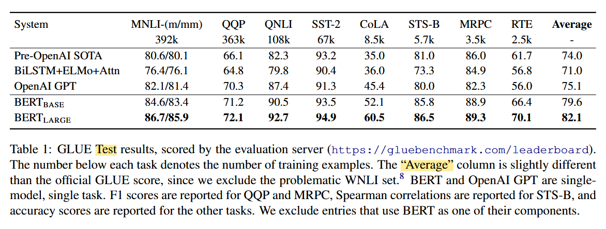

# [BERT](https://arxiv.org/abs/1810.04805): Bidirectional Encoder Representations from Transformers

Deep bidirectional Transformers (Encoder-only, MLM) + Next sentence prediction = Token-level + Sentence-level

Contributions:

- bidirectional pre-training
- reduce task-specific architecture = unify architecture accross different tasks
- sota performance over nlp tasks
- [google-research/bert: TensorFlow code and pre-trained models for BERT (github.com)](https://github.com/google-research/bert)

Related work

- Unsupervised Feature-based Approaches
- Unsupervised Fine-tuning Approaches
- Transfer Learning from Supervised Data
- [The Annotated Transformer (harvard.edu)](https://nlp.seas.harvard.edu/2018/04/03/attention.html)
- New version with PyTorch: [The Annotated Transformer (harvard.edu)](https://nlp.seas.harvard.edu/annotated-transformer/)

BERT = pre-training (unlabeled) + fine-tuning (labeled)

- Architecture: multi-layer bidirectional Transformer encoders
- Implementation: tensor2tensor library

| Variable | Meaning                               |
| -------- | ------------------------------------- |
| L        | Number of layers (Transformer blocks) |
| H        | Hidden size                           |
| A        | Number of self-attention heads        |

| Model      | L (Layers) | H (Hidden size) | A (Attention heads) | Total Parameters |
| ---------- | ---------- | --------------- | ------------------- | ---------------- |
| BERT_BASE  | 12         | 768             | 12                  | 110M             |
| BERT_LARGE | 24         | 1024            | 16                  | 340M             |

## 参数量计算

1. 嵌入层参数：
   - 词嵌入：vocab_size * hidden_size
   - 位置嵌入：max_position_embeddings * hidden_size
   - 段嵌入：type_vocab_size * hidden_size

2. 每个Transformer层的参数：
   - 自注意力层：4 * hidden_size * hidden_size
   - 前馈网络：4 * hidden_size * hidden_size
   - 层归一化：4 * hidden_size

3. 输出层参数：
   - 通常与词嵌入共享权重，所以不额外计算

大致计算公式：
总参数 ≈ 词嵌入参数 + 位置嵌入参数 + 段嵌入参数 + 层数 * (自注意力参数 + 前馈网络参数 + 层归一化参数)

对于BERT_BASE (L=12, H=768, A=12)：
- vocab_size=30000, max_position_embeddings=512, type_vocab_size=2
- 嵌入层：30000 * 768 + 512 * 768 + 2 * 768 ≈ 23.8M
- 每层参数：(4 * 768 * 768) * 2 + 4 * 768 ≈ 7.1M
- 总参数：23.8M + 12 * 7.1M ≈ 109M

对于BERT_LARGE (L=24, H=1024, A=16)：
- 嵌入层：30000 * 1024 + 512 * 1024 + 2 * 1024 ≈ 31.7M
- 每层参数：(4 * 1024 * 1024) * 2 + 4 * 1024 ≈ 12.6M
- 总参数：31.7M + 24 * 12.6M ≈ 334M

这些估算与论文中给出的110M和340M非常接近。实际数字可能因为一些实现细节和四舍五入而略有不同。计算总参数量有助于了解模型的复杂度和所需的计算资源。

## 输入输出表示

- single-sentence, double-sentence
- special token: [CLS], [SEP]
- WordPiece embedding + segment embedding + learned embedding E

## BERT

- Pre-training, two unsupervised tasks
  - Data (Document-level Corpus): BooksCorpus, English Wikipedia
  - MLM (Masked LM): mask random 15% tokens and predict them
    - Strategy: 80% [MASK] + 10% random + 10% unchanged
    - Ablation experiment
  - NSP (Next Sentence Prediction)
    - Strategy: 50% IsNext + 50% NotNext

- Fine-tuning, different supervised tasks

## Fine-tuning

- 处理文本对的方法：拼接的文本对应用自注意力，实现了两个句子间的双向交叉注意力
- 全量微调
- 输入：预训练中的句子A和B可以类比于各种下游任务中的输入对
  - 释义任务中的句子对
  - 蕴含任务中的假设-前提对
  - 问答任务中的问题-段落对
  - 文本分类或序列标注中的单文本（退化为文本-空对）
- 输出：
  - token级任务，使用token表示作为输出层
  - 分类任务，[CLS]

- (a)(b): sequence-level
- (c)(d): token-level

- E: input embedding; $T_i$: contextual representation of token $i$

## Fine-tuning Experiments

### GLUE

MNLI代表Multi-Genre Natural Language Inference（多类型自然语言推理），是GLUE（General Language Understanding Evaluation）基准测试中的一个重要任务。目的：评估模型理解和推断句子间逻辑关系的能力。

- 小数据集中微调不稳定
- bs: 32, epoch: 3, lr: 5e-5, 4e-5, 3e-5, and 2e-5

### SQuAD v1.1, v2.0

The Stanford Question Answering Dataset (SQuAD) 给定一段文本和一个相关问题，模型需要从文本中找出答案

任务描述：

- 除了回答可回答的问题外，模型还需要识别哪些问题是无法根据给定文本回答的。
- 对于可回答的问题，任务与v1.1相同。

评估指标：

- Exact Match (EM)：完全匹配的准确率。
- F1 score：部分匹配的评分。

### SWAG

The Situations With Adversarial Generations (SWAG) 评估模型的常识推理能力，特别是在日常情境中的推理

任务描述：

- 给定一个初始句子。
- 提供四个可能的后续句子选项。
- 模型需要选择最合理、最符合常识的后续句子。

## Ablation Studies

- NSP is better than LTR, RTL, ELMo

- Model size increases while performance increases
- Hypothesis: pre-train & fine-tuning allows downstream tasks perform great based on small fine-tuning dataset and larger & expressive pre-trained representations

- Feature-based approach advantages
  - not all tasks can be easily represented by a Trm encoder arch
  - cheap to pre-compute expensive representation once and compute multiple cheapers models on top of this representation
- BERT is effective for both finetuning and feature-based approaches

- Training steps increase slightly while 500k steps -> 1m steps

  - Steps 是更细粒度的计量单位，直接反映了模型参数更新的次数。

  - Epochs 给出了模型对整个数据集学习的完整周期数。

- Different masking procedures:15%(80+10+10) best

## BERT & GPT & ELMo

## Pre-training Procedure

- Combined sequence length: ≤ 512 tokens
- LM masking: 15% uniform masking rate after WordPiece tokenization
- Batch size: 256 sequences (128,000 tokens/batch)
- Training steps: 1,000,000 (approximately 40 epochs over 3.3 billion word corpus)
- Optimizer: Adam
  - Learning rate: 1e-4
  - β1 = 0.9
  - β2 = 0.999
  - L2 weight decay: 0.01
  - Learning rate warmup: over first 10,000 steps
  - Linear decay of learning rate
- Dropout probability: 0.1 on all layers
- Activation function: GELU (instead of standard ReLU)
- Training loss: sum of mean masked LM likelihood and mean next sentence prediction likelihood

## Fine-tuning Procedure

Fine-tuning optimal hyperparameter values are task-specific (batch size, learning rate, and number of training epochs), range of possible values

- Batch size: 16, 32
- Learning rate (Adam): 5e-5, 3e-5, 2e-5
- Number of epochs: 2, 3, 4

Large dataset is less sentitive than small dataset

