# Review

| 模型名称         | 发布时间        | 主要特点                                                     |
| ---------------- | --------------- | ------------------------------------------------------------ |
| GPT-1            | 2018            | • 5B 训练词料 • 1T参数 • pre-train + fine-tune         |
| GPT-2            | 2019            | • 40G 训练语料 • 15亿参数 • zero-shot                  |
| GPT-3            | 2020            | • 570G 训练语料 • 1750亿参数 • few-shot • 效果大幅提升 |
| CodeX            | 2021 - 2022     | • 初版Codex • 基于 120 亿参数的 GPT-3 • 在 GitHub 代码数据上微调 |
| InstructGPT      | 2022            | • 解决 align 问题 • 基于人类反馈指令微调 • SFT + RLHF  |
| Code-davinci-002 | 2022.4 - 2022.7 | • 二代Codex • 增加代码编程理解训练 • 有监督指令微调 • 偏重于代码能力 |
| Text-davinci-002 | 2022.5 - 2022.6 | • 在 Codex 基础上增加监督指令微调 • 侧重于文本能力        |
| Text-davinci-003 | 2022.11         | • 经过 RLHF 训练的 InstructGPT • 公开 NLP 任务效果更好    |
| ChatGPT          | 2022.11         | • 使用对话数据进行强化学习指令微调 • 增强对话能力和安全性显著提升 |

# [GPT-1](https://cdn.openai.com/research-covers/language-unsupervised/language_understanding_paper.pdf)

Task-agnostic model = Generative pre-training + Discriminative fine-tuning

## Model

- **Unsupervised pre-training**

$$
\begin{align}
L_1(U) &= \sum_i \log P(u_i|u_{i-k}, \ldots, u_{i-1}; \Theta) \tag{1} \\[10pt]

h_0 &= UW_e + W_p \\
h_l &= \text{transformer\_block}(h_{l-1})\forall i \in [1, n] \tag{2} \\
P(u) &= \text{softmax}(h_nW_e^T)
\end{align}
$$

- **Supervised fine-tuning**

$$
\begin{align}
P(y|x^1, \ldots, x^m) &= \text{softmax}(h_l^T W_y). \tag{3} \\[10pt]

L_2(C) &= \sum_{(x,y)} \log P(y|x^1, \ldots, x^m). \tag{4} \\[10pt]

L_3(C) &= L_2(C) + \lambda * L_1(C) \tag{5}
\end{align}
$$

- **Task-specific input transformations**

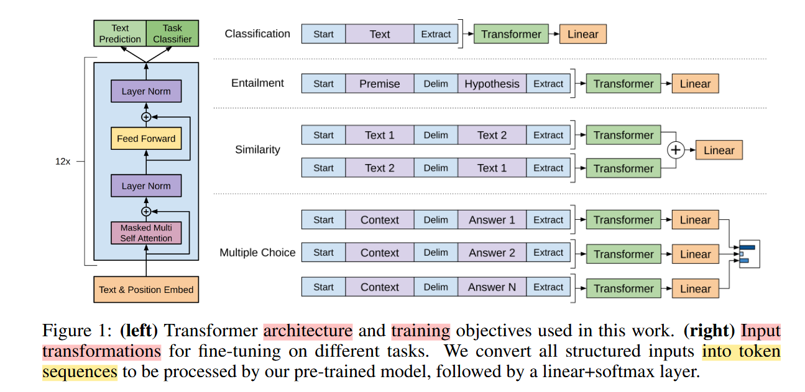

## Experiment

Pre-training

- Dataset: [BooksCorpus](https://arxiv.org/abs/1506.06724)
- N=12, H=768, A=12, Adam(max_lr=2.5e-4, 2000, cosine schedule to 0)
- epoch=100, batch_size=64, 512 tokens, BPE with 40000 merges, dropout=0.1, L2_w=0.01, GELU
- Learned position embeddings
- ftfy lib to clean text, spacy tokenizer

Fine-tuning

- batch_size=32, lr=6.25e-5, epoch=3, warm_up=0.2%
- $\lambda=0.5$

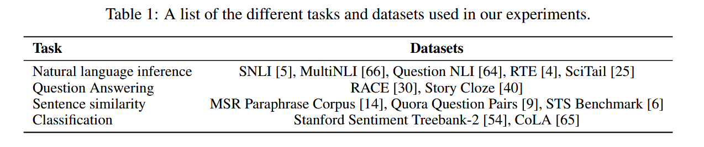

## Analysis

- Number of layers transferred
- Zero-shot starts here
- Ablation study

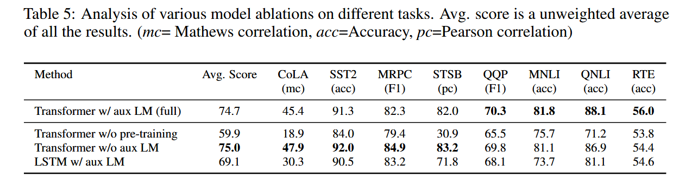

# [GPT-2](https://cdn.openai.com/better-language-models/language_models_are_unsupervised_multitask_learners.pdf)

正式提出 zero-shot 的设定，并且把这个作为后续LM的发展重点方向。

## Model

Language Modeling:
$$
p(x) = \prod_{i=1}^n p(s_n|s_1, ..., s_{n-1})
$$
General System:
$$
p(output|intput,task)
$$
Pre-training Dataset: WebText = subset of Common Crawl (Reddit)

Input Representation: Byte Pair Encoding (BPE), [Reference](https://arxiv.org/abs/1508.07909)

Model (based on GPT-1):

- LN: moved to input of each sub-block; additional one added fater final self-attention block
- Initialization: scale weights of residual layers by $\frac{1}{\sqrt{N}}$, N=number of residual layers
- Vocabulary: 50,257, Context size: 1024 tokens

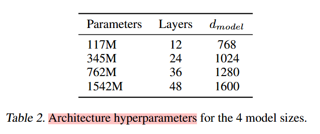

## Experiment

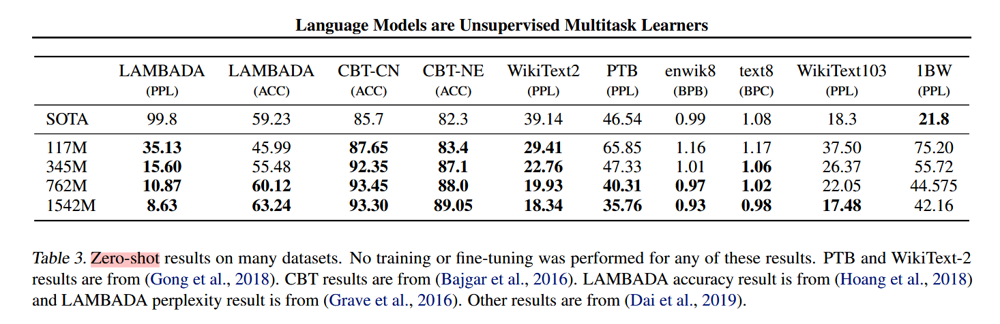

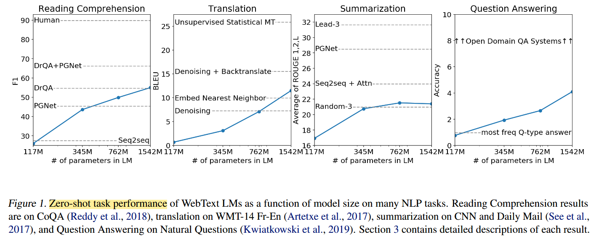

Benchmark:

- Language Modeling: zero-shot task transfer
- Children's Book Test: different categories of words
- LAMBADA: model long-range dependencies
- Winograd Schema Challenge: commonsense reasoning, resole ambiguities
- Reading Comprehension(CoQA): reading comprehension capability & answer q depend on history
- Summarization(CNN and Daily Mail dataset)
- Translation: WMT-14 English-French, WMT-14 French-English
- Question Answering: Natural Questions dataset, SQUAD

# [GPT-3](https://arxiv.org/abs/2005.14165)

Autoregressive scaling-up language model (175B params) improves task-agnostic, few-show performance.

Evaluation under three conditions:

- few-shot learning
- one-shot learning
- zero-shot learning

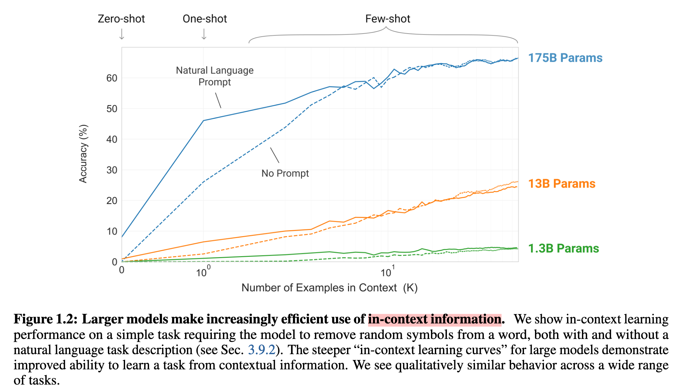

三个情况下不同模型参数量的评测表现

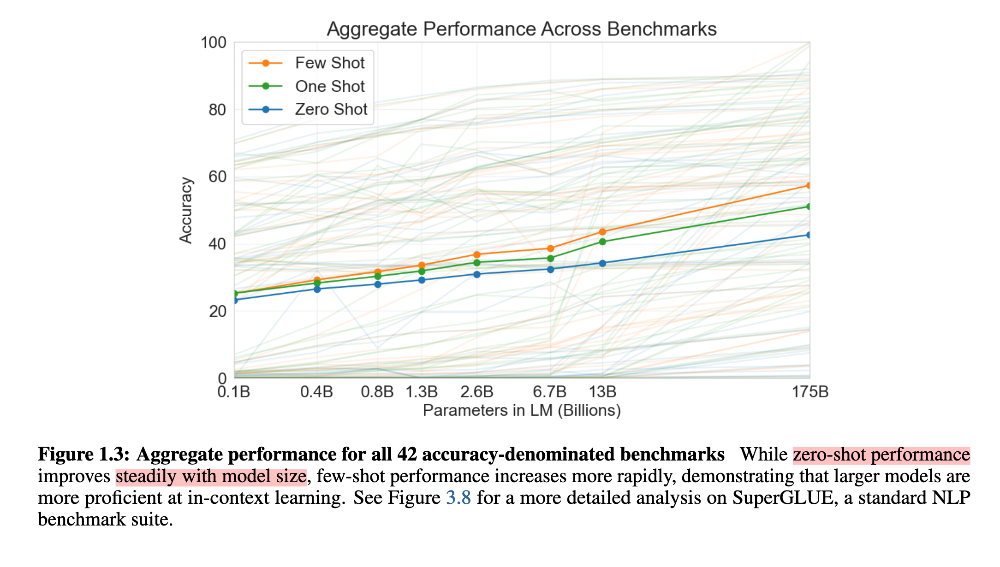

## Approach

> Our basic pre-training approach, including model, data, and training, is similar to the process described in [RWC+19], with relatively straightforward scaling up of the model size, dataset size and diversity, and length of training.
>
> [RWC+19] Alec Radford, Jeffrey Wu, Rewon Child, David Luan, Dario Amodei, and Ilya Sutskever. Language models are unsupervised multitask learners, 2019.

- 基础预训练（模型结构，数据，训练）和GPT-2类似
- 改变的方面：模型大小，数据集大小｜多样性，训练长短

Different settings (lying on a spectrum of how much task-specific data to rely on)

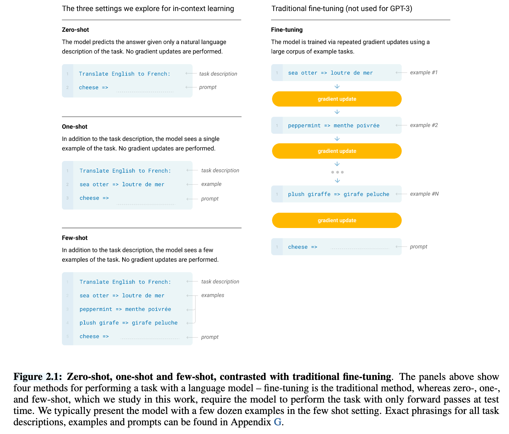

### Model and Architecture

GPT-2 的基础上

- modified initialization
- pre-normalization
- reversibale tokenization
- Sparse Transformer

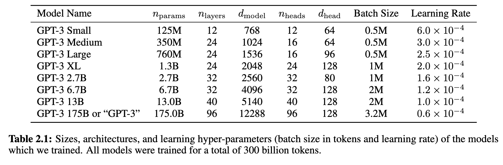

### Training Dataset

提高 CommonCrawl 文字数据集的质量

1. 下载并过滤 CommonCrawl 版本:
    基于与高质量参考语料的相似性,对 CommonCrawl 数据进行了下载和筛选。这意味着他们选择了更接近高质量标准的内容。
  1. classifier model to calculate document_score from CommonCrawl and high-quality documents, and add some random occasion: `np.random.pareto(α) > 1 − document_score`

  2. deduplicate documents using Spark's MinHashLSH with 10 hashes 

2. 执行模糊去重:
    在文档级别对数据集内部和跨数据集进行了模糊去重。这可以防止冗余,并保持验证集的完整性,使其能够准确衡量过拟合程度。

3. 添加已知的高质量参考语料:
    将已知的高质量参考语料（WebText，Wikipedia）加入训练数据中,以增强 CommonCrawl 数据并提高其多样性。

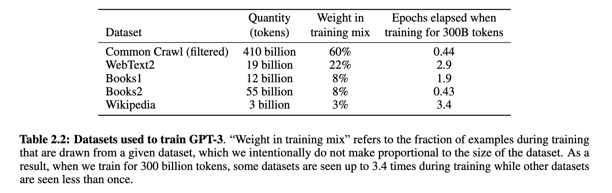

### Training

> As found in [KMH+20, MKAT18], larger models can typically use a larger batch size, but require a smaller learning rate.
>
> [KMH+20] Jared Kaplan, Sam McCandlish, Tom Henighan, Tom B. Brown, Benjamin Chess, Rewon Child, Scott Gray, Alec Radford, Jeffrey Wu, and Dario Amodei. Scaling laws for neural language models, 2020.
>
> [MKAT18] Sam McCandlish, Jared Kaplan, Dario Amodei, and OpenAI Dota Team. An empirical model of large-batch training, 2018.

- 每个矩阵乘法内部使用模型并行
- 网络的各层之间使用模型并行
- V100 GPU 微软的高带宽集群

### Evaluation

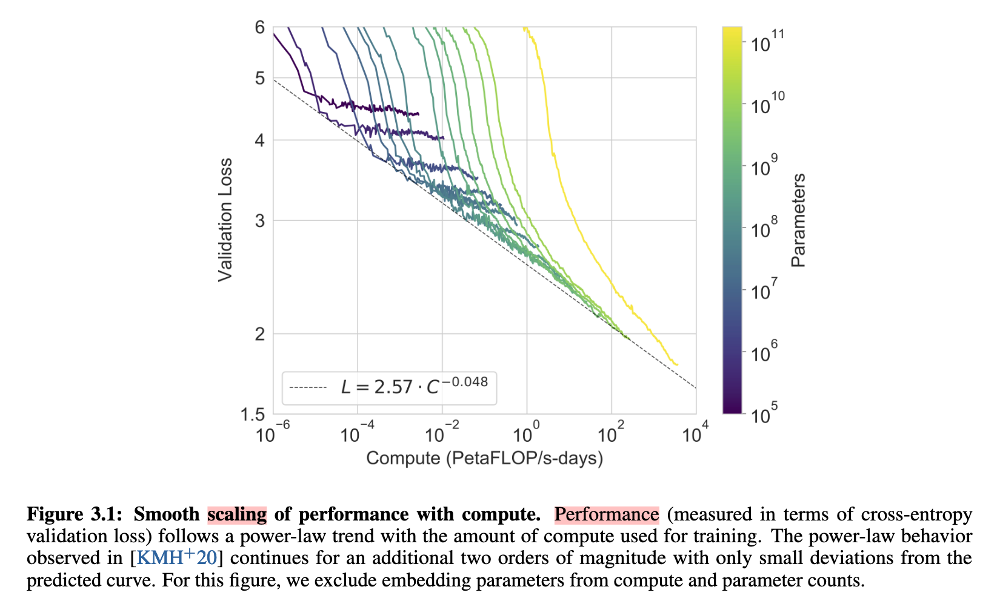

## Discussion

社会影响 societal impacts:

- Misuse, Threat Actor Analysis(APT), External Incentive Structures
- Fairness, Bias, and Representation, Gender, Race, Religion

