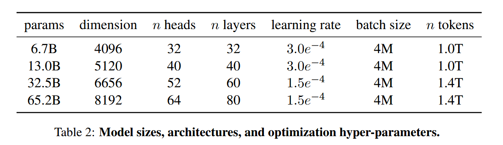

# Llama 1

> [LLaMA: Open and Efficient Foundation Language Models](https://arxiv.org/abs/2302.13971)
>
> Take-away messages:
>
> - Open-source architecture and data
> - Work well: 13B, 65B

## Architecture

- Pre-normalization: RMSNorm
- Activation: SwiGLU
- RoPE: Rotary Position Embedding
- AdamW: $\beta_1=0.9,\beta_2=0.95$
- LR: Cosine LR Scheduler, final_lr = 10% * max_lr, warm-up steps=2000
- Weight Decay: 0.1
- Gradient Clipping: 1.0

## Implementation

- xformers, flash-attention
- manually implement backward function for transformer layers, instead of relying on PyTorch autograd
- model and sequence parallelism, [here](https://arxiv.org/abs/2205.05198)

## Benckmark

Zero-show, Few-shot(1, 5, 64)

- Common Sense Reasoning
- Closed-book Question Answering
- Reading Comprehension
- Mathematical reasoning
- Code generation
- Massive Multitask Language Understanding
- Evolution of performance during training

## Bias, Toxicity, Misinformation

...

## Related Work

Model: BERT, GPT-2, Megatron-LM, T5, GPT-3, Jurassic-1, Megatron-Turing NLG, Gopher, Chinchilla, PaLM, OPT, GLM

# Llama 2

> [Llama 2: Open Foundation and Fine-Tuned Chat Models](https://arxiv.org/abs/2307.09288)
>
> Take-away messages:
>
> - Size: 7B, 13B, 70B, LLAMA2-CHAT for dialogue use

Models released:

- Llama 2: new mix of public data, size of pre-trained corpus, context-len * 2, grouped-query attention
- Llama 2-Chat: ft version for dialogue use cases

Safety, Red Teaming:

- Undone for this turn of research reading ...

## Pre-training

Data:

- public
- robust data cleaning
- updated data mixes

- up-sampling factual sources

Training strategy details:

- same as llama1: Transformer + RMSNorm + SwiGLU + RoPE + AdamW
- new: 2k->4k context length, GQA

Hyperparameters same as llama1

- AdamW: $\beta_1=0.9,\beta_2=0.95,eps=10^{-5}$
- Cosine LR: warm-up 2000, decay to 0.1
- Weight decay: 0.1, Gradient clipping: 1.0

Tokenizer:

- same as llama1: BPE algorithm, SentencePiece implementation
- vocab size: 32k

Evaluation:

- Code, Commonsense Reasoning, World Knowledge, Reading Comprehension, Math
- Popular Aggregated Benchmarks: MMLU, BBH, AGI Eval

- Compared with open-source models: MPT, Falconl; close models: GPT-3.5, GPT-4, PaLM

## Fine-tuning

Two steps: SFT(instruction), RLHF

### Instruction

- **Quality is all your need!**

- Instruction FT Dataset: small is ok, higher-quality is obligatory
- Collect 27,540 annotations
- Different annotation platform and vendors matter

> Similar idea (limited & clean instruction-tuning data) from: [Large Language Models are Human-Level Prompt Engineers]([2211.01910](https://arxiv.org/pdf/2211.01910))
>
> This paper proposed APE (Automatic Prompt Engineer)
>
>  
> 

### RLHF

1. Collect human preference data
2. Train a reward model
3. Iteratively train a ft model

#### Human Preference Data

Binary comparison protocol

- Different model variants, temperature hyper-parameter
- Choice: significantly better, better, slightly better, or negligibly better/ unsure

- Focus: Helpfulness, safety
- More preference data -> better reward model -> better chat model
- Hyper-param: lr = 2e-5, weight_decay = 0.1, bs = 64, seq_len = 4k, epoch = 2

#### Reward Modeling

RM:

- Input: prompt + response
- Output: scalar score = helpfulness + safety
- Helpfullness & Safety: trade-off => HRM, SRM
- Llama 2-chat and RM's data distribution must remain the same

Objectives:

- min loss: $\mathcal{L}_{\text{ranking}} = -\log(\sigma(r_\theta(x, y_c) - r_\theta(x, y_r) - m(r)))$

- margin: improve more separable samples

Data Composition:

- Add other open-source rm dataset -> generalization
- Helpfullness : Safety = 90 : 10 -> balance accuracy and safety

Training Details:

- AdamW with same params
- 5e-6 for 70B, 1e-5 for rest; Warm-up: 3% steps
- Batch: 512 pairs or 1024 rows

#### Iterative FT

Algorithms:

- PPO
- Rejection Sampling FT

Current method: (after RLHF V4)

- applying PPO on top of the resulted Rejection Sampling checkpoint before sampling again

Rejection Sampling:

- only on 70B, distilling it into smaller models
- mitigation for forgetting: incorporate top-performing samples from all prior iterations

PPO:

- RL scheme: [[2009.01325\] Learning to summarize from human feedback](https://arxiv.org/abs/2009.01325)
- Human feedback: Reward model as estimate for true rm, pre-trained model as policy to optimize

$$
\arg \max_{\pi} \mathbb{E}_{p\sim\mathcal{D},g\sim\pi}[R(g|p)] \\

R(g|p) = \tilde{R}_c(g|p) - \beta D_{KL}(\pi_\theta(g|p) \| \pi_0(g|p)) \\

R_c(g|p) = \begin{cases}
R_s(g|p) & \text{if is\_safety}(p) \text{ or } R_s(g|p) < 0.15 \\
R_h(g|p) & \text{otherwise}
\end{cases} \\

\tilde{R}_c(g|p) = \text{whiten}(\text{logit}(R_c(g|p)))
$$

System Message for Multi-Turn Consistency:

- GAtt: Ghost Attention
- From: Context Distillation

#### RLHF

(Uncovered)

- Model-based evaluation
- Human evaluation

# Llama 3

