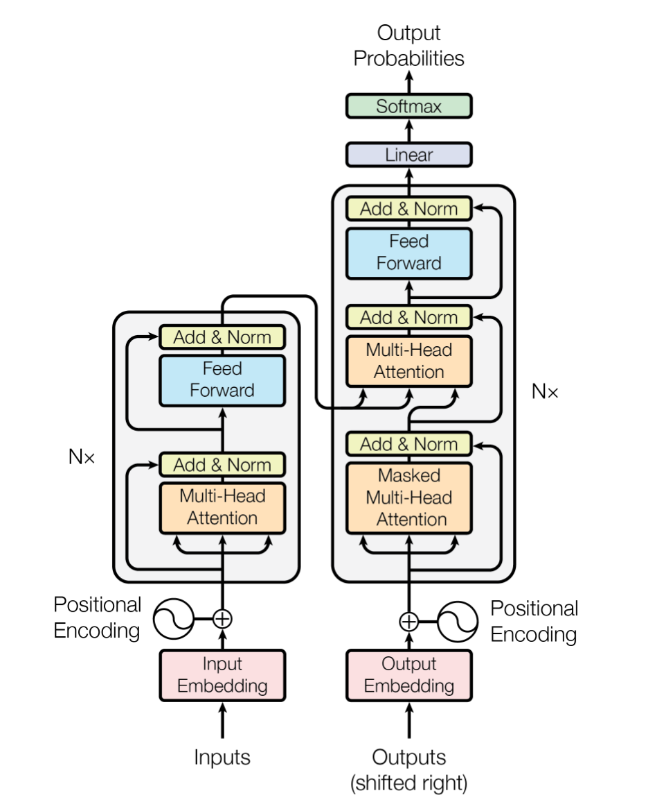
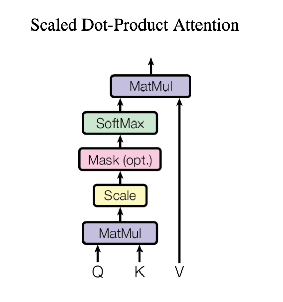
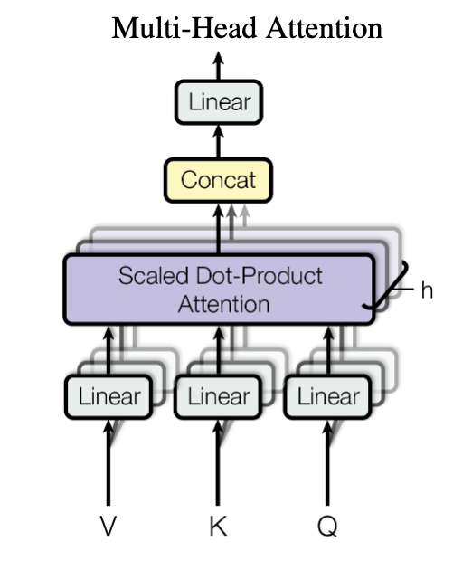
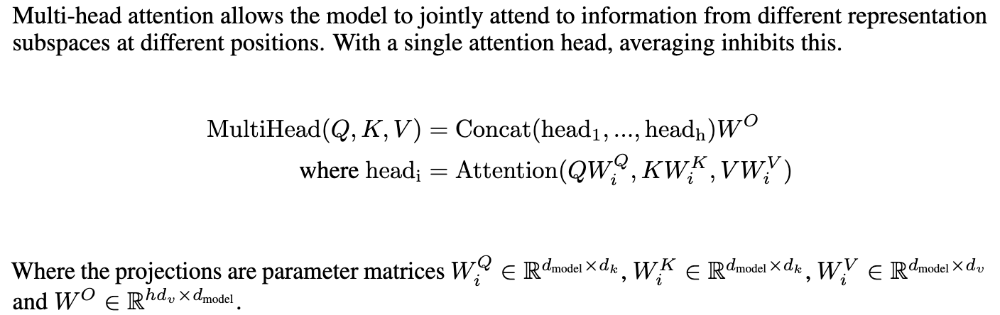
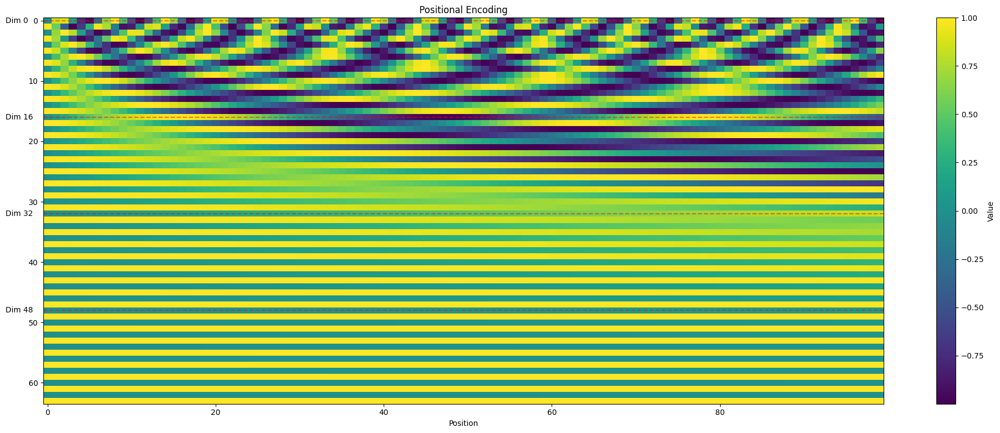

# [Attention Is All You Need](https://arxiv.org/abs/1706.03762)

## Key Concept

- tokenization
- input embedding
- position encoding
- residual
- q, k, v
- add & layer norm
- encoder & decoder
- attention & self-attention
- multi-head attention
- mask attention
- encoder & decoder attention
- output probability & logit & softmax

## Model Architecture

| 结构                                                                                                                                                                                 | 解析                                                                                                                                                                                                                                                                                                                                                                                                                                                                                                                                  |
| ------------------------------------------------------------------------------------------------------------------------------------------------------------------------------------ | ------------------------------------------------------------------------------------------------------------------------------------------------------------------------------------------------------------------------------------------------------------------------------------------------------------------------------------------------------------------------------------------------------------------------------------------------------------------------------------------------------------------------------------- |
|                                                                                         | Inputs, Outputs dim: $d_{model} = 512$ FFN inner-layer dimension: $d_{ff}=2048$ Encoder & Decoder Block Num: $N = 6$ Multi-head Attention's heads: $h = 8$ Q, K, V dimension: $d_k=d_v=d_{model}/h=64$ \|V\|: vocabulary size                                                                                                                                                                                                                                                                                    |
| **Embedding Layer (learned):** convert input/output tokens to vectors of dim $d_{model}$                                                                                        | $E(x)=xW_E$ $x$ dim: $(L,                                                                                                                                                                                                                                                                                                                                                                                        \| V                                \| )$ $W_E$ dim: $( \| V                               \| ,d_{model})$ |
| **Position Encoding:** provides a unique and information-rich representation for each position while maintaining information about the relative relationships between positions | $PE_{(pos,2i)} = sin(pos/10000^{2i/d_{model}})$ $PE_{(pos,2i+1)} = cos(pos/10000^{2i/d_{model}})$                                                                                                                                                                                                                                                                                                                                                                                                                                |
| **Encoder & Decoder Stacks**, `sub-layer`: - (Masked) Multi-Head Attention (learned) - Position-wise FNN - Residual Connection & Layer Normalization (learned)        | $\text{LayerNorm}(x+\text{SubLayer}(x))$ $\text{LayerNorm}(x) = \gamma \odot \frac{x - \mu}{\sqrt{\sigma^2 + \epsilon}} + \beta$                                                                                                                                                                                                                                                                                                                                                                                                 |
|                                                                        | Dot-product attention: $Attention(Q,K,V)=softmax(\frac{QK^T}{\sqrt{d_k}})V$ Why $\sqrt{d_k}$: To reduce the magnitude of the matrix multiplication result,  preventing it from entering regions where the softmax function has very small gradients.                                                                                                                                                                                                                                                                   |
|                                                                        |                                                                                                                                                                                                                                                                                                                                                                                                                         |
| **Position-wise Feed-Forward Networks (learned)**                                                                                                                                    | $FFN(x)=ReLu(0,xW_1+b_1)W_2+b_2$                                                                                                                                                                                                                                                                                                                                                                                                                                                                                                      |
| **Linear (learned) & Softmax**: convert decoder output to predict next-token prob                                                                                               | $z = W_o h_t + b_o$ $P(y_i\|x) = \frac{e^{z_i}}{\sum_{j=1}^{ \| V \| } e^{z_j}}$ - $W_o$ dim: $ \| V \| \times d_\text{model}$ - $h_t$ dim: $d_\text{model}$                                                                                                                                                                                                                                                                                                                                                           |

## Positional Encoding

Patterns:

- The top rows show rapid alternations between positive and negative values, representing high-frequency components.
- As we move down the dimensions, the patterns become more stretched out, showing lower-frequency components.
- The bottom rows show very slow changes, almost appearing as solid stripes.

This visualization demonstrates how positional encoding provides unique patterns for each position while maintaining relative positional information. The varying frequencies across dimensions allow the model to learn both fine-grained and coarse positional relationships.
